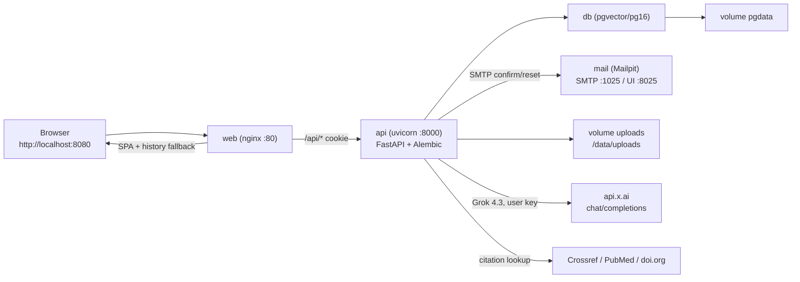
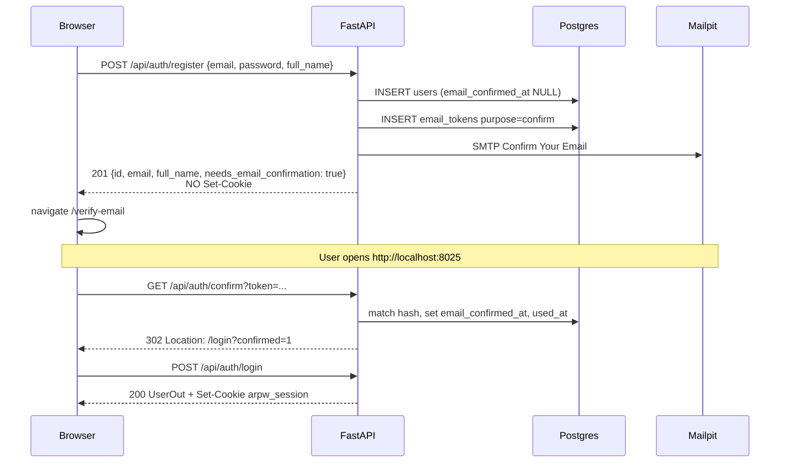
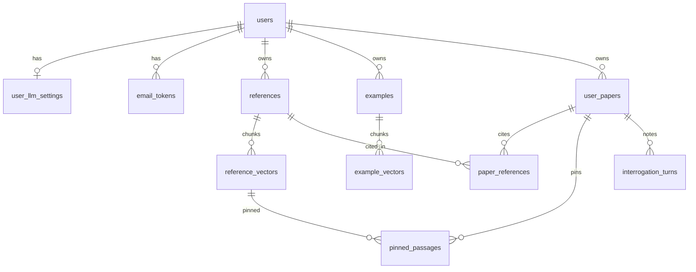

# arpw-local Architecture & Design

| Field | Value |
|---|---|
| **Title** | arpw-local: ARPW product on the RAGged local stack |
| **Author** | Engineering (draft) |
| **Date** | 2026-09-19 |
| **Status** | Draft |
| **Product source** | `~/Code/arpw` (functional copy) |
| **Stack source** | `~/Code/ragged` (Compose / FastAPI / React / pgvector) |
| **Target repo** | `~/Code/arpw-local` (empty; no commits yet) |

This document is the implementation spec (what to build). Slice order lives in [PLAN.md](./PLAN.md). Claims about ARPW and RAGged cite live files, not stale markdown under `ragged/documents/` (those still describe a Supabase Edge stack and **must not** be copied).

---

## Overview

**ARPW** (AI Research Paper Writer) is a single-researcher web app: upload your own papers, retrieve passages, pin them, interrogate the corpus, optionally generate an outline, generate a section-by-section literature-backed draft (Grok key required), then save and export. It is not a paper mill. Every citation must map to an uploaded, pinned, or retrieved passage.

The existing product (`~/Code/arpw`) is a Vite SPA talking to local Supabase (GoTrue, PostgREST, Storage, Deno Edge Functions). **arpw-local** is a *functional copy* of that product, rebuilt on the **RAGged** local stack: Docker Compose, FastAPI, Webpack React, Postgres/pgvector, named volumes, cookie JWT, local MiniLM embeddings. No Supabase runtime. No Vite in the Compose path.

The rewrite keeps ARPW’s paper-centric UX (dashboard → paper → upload / interrogate / prompt → library). It does **not** import RAGged’s thread-centric RAG chat as the primary surface. Interrogation remains notes on a paper, never generate `[S#]` evidence. The Interrogate tab **can** search all three corpora; it **defaults to and prefers** supporting reference papers (source 3), because the researcher already knows their own work.

---

## Background & Motivation

### Current ARPW (as-built)

From `arpw/.docs/TECHNICAL_SPECIFICATION.md` and `arpw/README.md`:

- React 18 + TypeScript + Vite 5 on `:5173`, Tailwind, `react-router-dom` 6 (`src/App.tsx`).
- Supabase Auth with email confirmation and password reset; local mailbox at `:54324`.
- Postgres + `pgvector` (384-d) with table RLS; Storage buckets `references` / `examples`; object key `{user_id}/{file_id}`.
- Deno Edge Functions: `upload_processor`, `embed_text`, `generate_paper`, `generate_outline`, `interrogate_corpus`, `lookup_citation` (`arpw/supabase/functions/`).
- Embeddings: `grok-embedding-small` at 384-d when a Grok key is saved, else `hash-384`. MiniLM is explicitly *not* the ARPW plan because there is no local model in Deno.
- Chat: xAI `grok-4.3` via `https://api.x.ai/v1/chat/completions`; user key from `read_grok_api_key` (service_role); SPA sees last4 only.
- Product is complete through generate, outline, pins, interrogation, QUAL-1–4, library export (`arpw/.docs/GAP_ANALYSIS.md`). Remaining: eval harness (recall@k), live Grok in unit tests (intentionally out).

Pain points of that stack for a *local* rewrite:

- `supabase start` + `supabase functions serve --network-id supabase_network_arpw` is fragile (Storage image tags, Deno lock files, two processes).
- Hash-384 fallback is a weak retriever; hosted Grok embeddings require a cloud key *just to index*.
- SPA talks PostgREST directly; Grok ciphertext isolation depends on GRANT/RLS, which is easy to get wrong (the old `user_profile.grok_api_key` column leaked via `select *`).

### Current RAGged (live stack)

From `ragged/README.md`, `ragged/docker-compose.yml`, and `ragged/api/app/`:

- One public HTTP port: nginx `:8080` proxies `/api` to FastAPI `:8000`.
- `pgvector/pgvector:pg16`; Alembic on API boot; named volumes `pgdata` and `uploads` (`UPLOAD_ROOT=/data/uploads`).
- Cookie JWT (`ragged_session`, HttpOnly, SameSite=lax); email/password; **no** email confirmation.
- Multipart upload in the API process: validate → write file → row `processing` → extract/chunk/embed → `ready`/`failed`; stale processing timeout 600s; delete file+rows+chunks (`ragged/api/app/routers/documents.py`).
- Local MiniLM `sentence-transformers/all-MiniLM-L6-v2` via fastembed, 384-d. Uploads do not need a cloud key (`EMBEDDING_PROVIDER=local`).
- User LLM keys Fernet-encrypted in `user_llm_settings` (`ragged/api/app/crypto.py`, `services/llm_keys.py`). SPA sees configured flags, never plaintext.
- Webpack + nginx (`ragged/web/`); optional `docker-compose.dev.yml` publishes API on host `:8001` for webpack-dev-server `:3000`.
- Tests: pytest `unit` / `uat` / `dogfood` slices + Jest.

RAGged’s product is *thread-centric document Q&A*. Copy its **mechanics**, not its UX.

---

## Goals & Non-Goals

### Goals

- Functional copy of ARPW P0/P1/P2 behavior that is already shipped (see [Feature parity matrix](#feature-parity-matrix)): auth with confirmation + reset, three upload sources (original research / examples / literature), retrieve, pins, interrogate (all three allowed, literature-focused), outline, generate (eight section checkboxes + type/style/format dropdowns), library, profile, **OpenAI / xAI / Anthropic chat keys** (RAGged).
- Single-command local DX: `docker compose up --build` → `http://localhost:8080/`.
- Same literature-review UAT playbook as `arpw/UAT/README.md` (20 PDFs, Grok key fixture, steps 1–13), adapted to port 8080 and cookie auth.
- An engineer can implement from this document without inventing APIs that contradict live RAGged or ARPW code.

### Non-Goals (MVP)

- Multi-author collaboration, sharing, OAuth, Kubernetes (ARPW PRD §2; RAGged README “What this app does not do”).
- Merging RAGged’s thread UI or importing chat transcripts as literature (`arpw/.docs/INTERROGATION_SLICES.md`).
- Treating Interrogate as an equal mix of the three corpora. Default and ranking prefer supporting papers (D15). Original research and examples stay optional includes.
- User-editable system prompts / per-section template editor (GEN-5 frozen templates).
- User-editable chat models or temperature (server owns `CHAT_MODELS` per provider, like RAGged).
- Mixing embedding models in one cosine search.
- Eval harness / paraphrase recall@k (ARPW leftover, not UAT).
- Journal submission, plagiarism scanning, publisher templates, mobile-first layout.
- Copying `ragged/documents/API.md` or `AUTH_SYSTEM.md` (stale Supabase).

---

## Key Decisions

| # | Decision | Choice | Rationale |
|---|---|---|---|
| D1 | Repo layout | RAGged: `api/`, `web/`, compose, Alembic, `tests/{unit,uat,dogfood}` | One public port, proven Compose; ARPW product does not need a different tree. |
| D2 | Auth | Cookie JWT like RAGged **plus** email confirmation and password reset via Mailpit + Postgres tokens | AUTH-7/AUTH-8 are P0. Doable without Supabase. Register does **not** set a session cookie. |
| D3 | Isolation | App-layer `user_id` on every query (RAGged `get_current_user`), **not** Postgres RLS | No PostgREST. FastAPI is the only data plane. NFR-1 **Adapt**: equivalent isolation + tests. |
| D4 | Chat keys | Paste in the UI only (RAGged `LlmSettings` + ARPW Profile). Fernet on `user_llm_settings`. SPA `{configured, last4}` per provider. **No** `OPENAI_API_KEY` / `XAI_API_KEY` / `ANTHROPIC_API_KEY` in `.env` | Live RAGged tests put keys via `PUT /api/settings/llm` (`test_unit_llm_settings.py`). Do **not** port `resolve_key` env fallback. |
| D5 | Embeddings | Local MiniLM 384-d for **all** ingest and query. Stored model string is always `sentence-transformers/all-MiniLM-L6-v2`. No `hash-384` in production. No Grok embeddings in MVP. **Do not port** `matchWithModelFallback` | Uploads work without a cloud key (RAGged). Hash-384 exists in ARPW only because Deno has no MiniLM. Never mix models; one string in ingest, vectors, SQL `filter_model`, and `EMBEDDING_MODEL`. |
| D6 | Chat LLM | One `chat_provider` (OpenAI / xAI / Anthropic). **Interrogate, outline, and generate all call the same `chat.complete()`** with that provider. Timeout 120s. xAI model `grok-4.3` | No Grok-only generate path. The AI you pick for Interrogate is the AI that drafts the paper. |
| D7 | Data model | Paper-centric ARPW tables. **No** `threads` / `conversations` / `documents` as the UX | Interrogation is notes on a paper (`interrogation_turns`), not RAGged threads. |
| D8 | Storage | Named volume `uploads` → `/data/uploads`; key `{user_id}/{file_id}.{ext}` | RAGged volume mechanics; ARPW user isolation; extension kept so `detect_kind` is not the only source of truth on disk. |
| D9 | Upload/ingest | RAGged **per-file** in-process mechanic: SPA `POST` **one file per request**; validate → write → `processing` → extract/chunk/embed → `ready`/`failed`; 600s stale timeout. nginx `client_max_body_size 55m`; `MAX_UPLOAD_BODY_BYTES=12582912` (12 MiB) | Matches ARPW `UploadZone.uploadFile` (one Storage object + one processor invoke per file). A 10×10 MB batch is 10 POSTs, not one 105 MB multipart. Caps, `source_role`, IMRaD, `chunk_role` stay. |
| D10 | Retrieval / generate | Rewrite FastAPI retrieve against ARPW **product rules** (pins-first, role filter, hybrid FTS+RRF); port templates/generate/interrogate/citations. Full-draft generate; nginx generate location duplicates full proxy + `2100s` | Generate section-filters the three corpora. Interrogate prefers literature (D15). Chat abort is **120s** → `"Chat request timed out after 2 minutes"` (same helper as Interrogate). Do **not** line-port `retrievePassages.ts` `hashEmbedding` / `matchWithModelFallback`. |
| D11 | Frontend | Webpack + nginx (RAGged Compose) + **ARPW screens** + `react-router-dom` | One public port. Vite is a documented *non*-choice unless we give up nginx-on-8080. |
| D12 | Testing | pytest unit/uat/dogfood + Jest; port ARPW helper tests; literature-review UAT | RAGged test shape; ARPW product assertions (caps, `[S#]`, nfr7probe). |
| D13 | Password length | Keep ARPW **6** (not RAGged’s 8) | AUTH product copy and `validateAuth.ts` `MIN_PASSWORD_LENGTH = 6`. |
| D14 | Docs | Diataxis: root `README.md` + `docs/` (not hidden `.docs/`) | ARPW index shape, written for this stack. |
| D15 | Interrogate corpus | All three sources **allowed**. Default `sources=["literature"]`. When literature is included, **16 of k=20** slots are literature; remaining 4 fill from opted-in primary/examples by score | Researcher already knows their own papers and this-study notes. Supporting papers (#3) are the thing they need to interrogate. ARPW default `both` and “examples never searched” are **Adapt**. |
| D16 | Generate form | Eight **section checkboxes** plus three **dropdowns**: Paper Type, Citation Style, Output Format. Options are the ARPW enums (`types.ts` / `generationTemplates.ts`) | Port `PaperGenerationPage` Prompt tab and dashboard “Start paper” type select. Literature Review / APA / Markdown are valid selections (UAT uses them), not the only values. |

---

## Proposed Design

### Three corpora

ARPW (and arpw-local) has **three** upload sources. They share ingest mechanics (volume, MiniLM, IMRaD). Generate and Interrogate use them differently.

| # | User name | Storage | `source_role` | Cap | Generate | Interrogate |
|---|---|---|---|---|---|---|
| 1 | Original research supporting the paper being written | `"references"` | `primary` | Shares 500 with #3 | Methods/Results (and Abstract/Intro unless Literature Review) | Optional include; **off by default** |
| 2 | The author’s own papers for style and voice | `examples` | none | 10 | Style prefix only. Never draft `[S#]`, never pinable | Optional include; **off by default**. Q&A `[S#]` in notes only; still not pinable into the draft |
| 3 | Research papers used as references (supporting papers) | `"references"` | `literature` (default) | Shares 500 with #1 | Citations; pins-first retrieve | **On by default.** Majority of k when included |

Upload tab still has three sections (ARPW `PaperGenerationPage` literature / original research / examples). Recategorize literature ↔ primary stays (DOCS-8). Dashboard counts stay split.

**Why Interrogate prefers #3:** the researcher already knows their own voice (examples) and this-study material (primary). The supporting papers are the corpus they need to ask questions of. They can still opt in #1 and #2 for a given question.

Generate section role filter is unchanged (table below): original research still feeds Methods/Results; Literature Review paper type still ignores `primary`. The **Prompt tab** generate surface is D16.

### Generate form (D16)

Port ARPW `PaperGenerationPage` Prompt tab (`src/pages/PaperGenerationPage.tsx`) and dashboard Start paper (`src/pages/HomePage.tsx`). Same widgets: **checkboxes** for sections, **`<select>` dropdowns** for type / citation style / output format. Options come from `arpw/src/types.ts` and `PAPER_SECTIONS` in `generationTemplates.ts`.

**Paper Sections** — checkboxes, any non-empty subset (at least one to generate):

| Checkbox | Grok? | Notes |
|---|---|---|
| Abstract | yes | |
| Introduction | yes | |
| Literature Review | yes | |
| Methods | yes | |
| Results | yes | |
| Discussion | yes | |
| Conclusion | yes | |
| References | **no** | Built from cited ids + `citation_text` for the selected citation style. Not a Grok call |

**Paper Configuration** — three dropdowns (`<select>`), not free text, not a single locked triple:

| Dropdown | Options (exact strings) | Create default (ARPW `createDraftPaper` / `HomePage`) |
|---|---|---|
| Paper Type | `Empirical Study`, `Literature Review`, `Theoretical Paper`, `Case Study` | Dashboard select; initial option **Empirical Study**. Type picks the frozen template pack. |
| Citation Style | `APA`, `MLA`, `Chicago` | **APA** |
| Output Format | `markdown`, `word` (UI labels **Markdown** / **Word**) | **Markdown** |

Literature Review / APA / Markdown are **selected values** in those dropdowns (literature-review UAT sets them). They are not the only options.

Changing Paper Type on the Prompt tab persists `paper_type` and switches retrieve templates (`preferredSourceRole`: Literature Review → `literature` only, including ignoring `primary` pins). It does **not** rewrite the section checkboxes.

New draft sections: copy ARPW `DEFAULT_PAPER_SECTIONS` (Abstract, Introduction, Methods, Results, Discussion, Conclusion). Literature Review and References stay unchecked until the user ticks them — except the UAT runner, which sets Abstract, Introduction, Literature Review, Discussion, Conclusion, References.

Continue must restore the saved type/style/format/sections (UAT gate: Literature Review stays Literature Review).

### Runtime topology



Compose services (follow `ragged/docker-compose.yml`, plus Mailpit):

| Service | Image / build | Ports | Notes |
|---|---|---|---|
| `db` | `pgvector/pgvector:pg16` | none published | Health: `pg_isready`. Volume `pgdata`. `shm_size: 128mb`. |
| `api` | `./api` | none in prod compose | `alembic upgrade head && uvicorn app.main:app --host 0.0.0.0 --port 8000 --workers 2`. Volume `uploads` → `/data/uploads`. `DATABASE_URL` assembled from `POSTGRES_*` (do not set in `.env`). |
| `web` | `./web` (nginx) | **`8080:80`** | Proxies `/api/` to `api:8000`. `client_max_body_size 55m` (one file ≤ 10 MiB; **not** a 10×10 MB batch). Default `proxy_read_timeout` / `proxy_send_timeout` **600s**. A **sibling regex location** for generate (trailing slash optional) duplicates the **full** `/api/` proxy settings (not timeout-only — nginx regex locations do not inherit `proxy_pass`) with **2100s**. Outline stays on `/api/` (600s). Do not copy RAGged tests that treat 55m as a multi-file product limit. |
| `mail` | `axllent/mailpit` | **`8025:8025`** (UI only) | SMTP internal `mail:1025`. Sidecar for AUTH-7/8; not the app’s public port. |

Dev overlay (`docker-compose.dev.yml`, copy RAGged): publish `api` as `8001:8000` so host webpack-dev-server `:3000` can proxy `/api`. Dogfood remains nginx `:8080` unless iterating on webpack.

Health (copy RAGged `ragged/api/app/main.py`):

- `GET /api/health` — **async, no I/O**. Must stay green while ingest/generate occupies a worker. Compose healthcheck hits this (not `/ready`).
- `GET /api/ready` — sync `SELECT 1`. May stall if **both** workers are in generate/ingest; dogfood is single-user. Do not use `/ready` as the container healthcheck.

### Repo layout

```
arpw-local/
├── api/
│   ├── Dockerfile                 # python:3.12-slim; pre-pull MiniLM into /models (RAGged)
│   ├── requirements.txt
│   ├── requirements-dev.txt
│   ├── alembic.ini
│   ├── alembic/versions/          # 0001_initial (full paper-centric schema)
│   ├── app/
│   │   ├── main.py
│   │   ├── config.py
│   │   ├── db.py
│   │   ├── models.py
│   │   ├── schemas.py
│   │   ├── auth_utils.py
│   │   ├── crypto.py
│   │   ├── deps.py
│   │   ├── origin.py              # CSRF Origin allowlist (RAGged)
│   │   ├── mailer.py              # SMTP to Mailpit
│   │   ├── routers/
│   │   │   ├── auth.py
│   │   │   ├── settings.py        # Grok key only
│   │   │   ├── documents.py       # references + examples
│   │   │   ├── papers.py
│   │   │   ├── retrieve.py
│   │   │   ├── generate.py        # generate + outline
│   │   │   ├── interrogate.py
│   │   │   └── citations.py
│   │   └── services/
│   │       ├── files.py
│   │       ├── extract.py         # per-page PDF; heading-aware DOCX
│   │       ├── chunk.py           # IMRaD windows (port ingest.ts)
│   │       ├── classify.py        # academic chunk_role (port chunkRoles.ts)
│   │       ├── embeddings.py      # MiniLM / stub
│   │       ├── chat.py            # RAGged complete() — openai / xai / anthropic
│   │       ├── llm_keys.py        # encrypt / resolve / chat_provider
│   │       ├── retrieve.py        # product rules: pins-first, role filter, hybrid RRF; MiniLM only
│   │       ├── generate.py        # section loop, allow-list, repair
│   │       ├── outline.py
│   │       ├── interrogate.py
│   │       ├── citations.py       # [S#] numbering, stripUnknownCitations
│   │       ├── attribution.py     # QUAL-1
│   │       ├── citation_check.py  # QUAL-2
│   │       ├── format_check.py    # QUAL-3
│   │       ├── bibliographic.py
│   │       └── templates.py       # frozen type × section
│   └── (no api/tests — pytest.ini testpaths = tests only)
├── web/
│   ├── Dockerfile                 # node:20 build → nginx:1.27
│   ├── nginx.conf
│   ├── webpack.config.js
│   ├── package.json
│   └── src/                       # ARPW screens, not RAGged ThreadList/ChatInterface
│       ├── App.tsx
│       ├── lib/api.ts             # credentials: 'include'
│       ├── context/AuthContext.tsx
│       ├── components/…           # port from arpw/src/components
│       └── pages/…                # HomePage, PaperGenerationPage, LibraryPage
├── tests/
│   ├── conftest.py
│   ├── compose_support.py
│   ├── fixtures/nfr7.pdf          # synthetic NFR-7 PDF (no PII); not under api/tests/
│   ├── unit/
│   ├── uat/
│   └── dogfood/
├── UAT/                           # literature-review playbook (port arpw/UAT)
│   ├── README.md
│   ├── run-literature-review.mjs  # Playwright against :8080
│   └── papers/                    # gitignored PDFs
├── docs/                          # Diataxis engineering specs
├── scripts/smoke.sh
├── docker-compose.yml
├── docker-compose.dev.yml
├── pytest.ini
├── .env.example
└── README.md
```

**Do not** add `threads` routers, `messages` routers, or RAGged `web/src/components/Threads|Chat`.

### Frontend choice (D11)

**Webpack + nginx**, not Vite.

- Compose already serves one public port. RAGged’s `web/Dockerfile` builds webpack into `dist/` and copies onto nginx; `nginx.conf` does `/api/` proxy + SPA `try_files`.
- Vite would mean either (a) a second public port (`:5173`, ARPW today) or (b) a custom nginx that still has to proxy `/api` — extra moving parts for no product gain.
- ARPW’s `react-router-dom` routes are required (`/login`, `/verify-email`, `/generate/interrogate?paper=…`). Add `react-router-dom` 6 to `web/package.json` (RAGged’s SPA has no router). Keep React 18 + TypeScript + Tailwind 3 + Jest.

Dev: `docker compose -f docker-compose.yml -f docker-compose.dev.yml up --build` then `cd web && npm run dev` (webpack `:3000` → `localhost:8001`). `PUBLIC_ORIGINS` includes both `http://localhost:8080` and `http://localhost:3000` (RAGged `origin.py`).

Port ARPW screens that the router actually mounts (`arpw/.docs/TECHNICAL_SPECIFICATION.md` §3). **Do not port** unused `LoginPage.tsx` / `ProfilePage.tsx` / `DashboardPage.tsx` (App mounts `Login.tsx` / `Profile.tsx` / `HomePage.tsx`). `ProfilePage.tsx` still has a `grok_api_key` form field — never copy that.

| Path | Component (from ARPW) | Gate |
|---|---|---|
| `/login` | `Login.tsx` | Public; confirmed session → `/dashboard` |
| `/verify-email` | `VerifyEmail.tsx` | Public; confirmed → `/dashboard` |
| `/forgot-password` | `ForgotPassword.tsx` | Public; confirmed → `/dashboard` |
| `/reset-password` | **rewrite** `ResetPassword.tsx` | Public; reads `?token=` and POSTs `/api/auth/reset-password`. Not a GoTrue recovery session. |
| `/dashboard` | `HomePage.tsx` | Confirmed session |
| `/generate` | `PaperGenerationPage.tsx` Prompt | Same |
| `/generate/upload` | same, Upload tab | Same |
| `/generate/interrogate` | same, Interrogate tab | Same |
| `/profile` | `Profile.tsx` | Same |
| `/library` | `LibraryPage.tsx` | Same |
| `/` | redirect `/dashboard` | Same |

Replace `arpw/src/supabaseClient.ts` + PostgREST calls with `web/src/lib/api.ts` patterned on `ragged/web/src/lib/api.ts` (`credentials: 'include'`, `ApiError`, `arpw:unauthorized` event). AuthContext **PR 03:** `GET /api/auth/me` only; llm settings unset. **PR 04** adds `GET /api/settings/llm` after `/me`. Never put ciphertext, full key, or last4 on `/auth/me`. VerifyEmail mailbox copy is Mailpit **`http://localhost:8025`**, not Inbucket `:54324`. Persist signup email in `location.state` (already in ARPW `Login.tsx`) for resend; resend does not need an unconfirmed cookie. Do not treat a second `POST /auth/register` as resend (409 if email taken).

### Auth (D2, D13)

RAGged today (`ragged/api/app/routers/auth.py`): register hashes password, inserts `users`, **sets session cookie immediately**. No confirmation. Password min 8 (`AuthCredentials`).

ARPW P0: AUTH-7 (no app access until `email_confirmed_at`), AUTH-8 (reset by email). Local mailbox is Mailpit.

**Preserve product behavior without Supabase.**

#### User record

Fold ARPW `user_profile` into `users` (no `auth.users` to trigger on). AUTH-3 **Adapt**: the profile *is* the user row, created at register.

```text
users
  id              UUID PK DEFAULT gen_random_uuid()
  email           TEXT UNIQUE NOT NULL CHECK (email = lower(email))
  password_hash   TEXT NOT NULL
  full_name       TEXT          -- signup required, ≥ 2 chars
  email_confirmed_at TIMESTAMPTZ NULL
  created_at      TIMESTAMPTZ NOT NULL DEFAULT now()
  updated_at      TIMESTAMPTZ NOT NULL DEFAULT now()
```

Password hashing: copy RAGged `auth_utils.py` (SHA-256 then bcrypt, dummy hash for missing users to keep verify constant-time). Cookie: `COOKIE_NAME=arpw_session`, HttpOnly, SameSite=lax, Path=/, `COOKIE_SECURE` from env. JWT payload `{sub, email, iat, exp}`; TTL 7 days (`JWT_TTL_SECONDS=604800`). `get_current_user` reads the cookie (`ragged/api/app/deps.py`).

**Confirmed-only dependency:** `get_confirmed_user` = `get_current_user` plus `email_confirmed_at is not None`. All product routers use this. Auth routers that must work unconfirmed (resend) use `get_current_user` or are public.

Minimum password length: **6** (ARPW `src/lib/validateAuth.ts`), enforced in Pydantic and DB is unnecessary if the API is the only writer.

#### Email tokens

```text
email_tokens
  id           UUID PK
  user_id      UUID NOT NULL REFERENCES users(id) ON DELETE CASCADE
  purpose      TEXT NOT NULL CHECK (purpose IN ('confirm', 'reset'))
  token_hash   TEXT NOT NULL UNIQUE -- sha256 hex of the raw token
  expires_at   TIMESTAMPTZ NOT NULL -- now() + 3600s for confirm AND reset (ARPW otp_expiry)
  used_at      TIMESTAMPTZ
  created_at   TIMESTAMPTZ NOT NULL DEFAULT now()
```

Raw token is a 32-byte urlsafe secret, emailed once, stored hashed. One-shot (`used_at`). Unique index on `token_hash` (lookup + collision). TTL **3600s** for both `confirm` and `reset` (ARPW `otp_expiry = 3600`, not 24h). Rate: max 30 mails per email per hour (ARPW `[auth.rate_limit] email_sent = 30`) — count `email_tokens.created_at` for that user.

Issuing a new confirm token is **only** `POST /api/auth/resend-confirmation` (and the first token created at register). `POST /api/auth/register` stays **409 if email taken** (AUTH-1 open signup; email enumeration accepted). Do not treat a second signup as resend. On resend, in the **same transaction**: `UPDATE email_tokens SET used_at = now() WHERE user_id = :id AND purpose = 'confirm' AND used_at IS NULL`, then `INSERT` the new row. Same invalidate-then-insert for reset tokens (`purpose = 'reset'`) on forgot-password. Double-submit of the same raw token: first success sets `used_at`; second is invalid (302 / 400).

#### Flows



| Endpoint | Behavior |
|---|---|
| `POST /api/auth/register` | Validate email regex, password ≥ 6, full_name ≥ 2. 409 if email taken. **Do not** set cookie. Send confirm mail. Body includes `needs_email_confirmation: true`. |
| `POST /api/auth/login` | Unknown/wrong password → 401 `"Invalid email or password"` (AUTH-6). Unconfirmed → **403** `{detail, code: "email_not_confirmed"}`. Confirmed → set cookie, return user. |
| `POST /api/auth/logout` | Clear cookie, 204 (works without a cookie, like RAGged). |
| `GET /api/auth/me` | Cookie required. Returns `UserOut` including `email_confirmed_at`, `full_name`. SPA treats missing/null confirmation as `/verify-email`. |
| `PATCH /api/auth/me` | `{full_name}` AUTH-4. Confirmed only. |
| `POST /api/auth/resend-confirmation` | `{email}`. Always 200 generic message. If unconfirmed user exists and under rate limit, invalidate unused prior confirm tokens (`used_at = now()`) and insert a new hash in the same transaction, then send mail. No session cookie required (signup email in `location.state`). |
| `GET /api/auth/confirm` | Query `token`. **Browser navigation** through nginx (mail link). Success → **302** `/login?confirmed=1`. Invalid, expired, or already used → **302** `/verify-email?error=invalid` (no token echo, no JSON, no HTML error page). |
| `POST /api/auth/forgot-password` | `{email}`. Always 200 `"If an account exists for … a reset link is on its way."` Send reset mail only for **confirmed** users. Link: `{PUBLIC_APP_URL}/reset-password?token=...`. |
| `POST /api/auth/reset-password` | `{token, password}`. One-shot. Sets password, marks token used, **sets session cookie**. SPA goes to `/dashboard`. Invalid/expired/used → 400 `"This reset link is invalid or has expired"`. |

`PUBLIC_APP_URL` default `http://localhost:8080` (used in mail links). CSRF: copy `ragged/api/app/origin.py` as-is. Mutating requests with a **present** `Origin` not in `PUBLIC_ORIGINS` → 403. **Missing Origin is allowed** (curl, Compose tests, operators). Exempt only `POST /api/auth/login` and `POST /api/auth/register` (RAGged). Do **not** special-case forgot/reset — the SPA on `:8080`/`:3000` sends an allowed Origin; Mailpit does not POST those paths. Confirm is GET (no CSRF). SameSite=lax mitigates cross-site cookie POSTs.

**ResetPassword is not a port of `arpw/src/components/ResetPassword.tsx`.** Live ARPW uses GoTrue `PASSWORD_RECOVERY` + `updatePassword()` with **no query token**. arpw-local:

1. Mail link lands on `{PUBLIC_APP_URL}/reset-password?token=...`.
2. Component reads `token` from `useSearchParams`. No token (or empty) → existing copy “This reset link is invalid or has expired” + link to `/forgot-password` (keep that UI).
3. Submit → `POST /api/auth/reset-password` `{token, password}` (min 6, confirm match client-side).
4. Success → cookie + `navigate('/dashboard', { replace: true })`.
5. Ignore any leftover `arpw_session` until reset succeeds (do not treat `/reset-password` as a logged-in shell).

Mail templates (plain text is enough):

- Subject `Confirm Your Email` — link to `{PUBLIC_APP_URL}/api/auth/confirm?token=...` (API 302 to `/login` or `/verify-email?error=invalid`).
- Subject `Reset Your Password` — link to `{PUBLIC_APP_URL}/reset-password?token=...`. Mailpit UI: `http://localhost:8025`.

### Chat keys (D4)

ARPW: `user_grok_keys` + pgcrypto; one xAI key; SPA `{set, last4}`.

RAGged: `user_llm_settings` + Fernet from SHA-256(`JWT_SECRET`) (`ragged/api/app/crypto.py`, `services/llm_keys.py`); three keys + `chat_provider`; SPA `{configured: bool}` only.

**Port RAGged’s table and add ARPW last4:**

```text
user_llm_settings
  user_id            UUID PK REFERENCES users(id) ON DELETE CASCADE
  openai_key_enc     TEXT NULL
  xai_key_enc        TEXT NULL
  anthropic_key_enc  TEXT NULL
  openai_last4       TEXT NULL
  xai_last4          TEXT NULL
  anthropic_last4    TEXT NULL
  chat_provider      TEXT NOT NULL DEFAULT 'xai'
                     CHECK (chat_provider IN ('openai', 'xai', 'anthropic'))
  updated_at         TIMESTAMPTZ NOT NULL
```

Default `chat_provider` is **`xai`** (ARPW generate/UAT), not RAGged’s `openai`.

No GRANT gymnastics: FastAPI is the only reader. SPA never has a SQL client.

Port RAGged `llm_keys.py` **without** the env branch in `resolve_key` / `configured_map`. Those functions in live RAGged still read `settings.OPENAI_API_KEY` etc.; arpw-local must not. `configured` is true only when the user row has ciphertext. `resolve_key` decrypts that row or returns `None`.

Live RAGged proof the product path is paste-in-UI: `tests/unit/test_unit_llm_settings.py` `PUT /api/settings/llm` with `openai_api_key` / `xai_api_key` / `anthropic_api_key`; GET body never contains the secret; selecting a provider with no saved key is 422.

| API | Who | Body / result |
|---|---|---|
| `GET /api/settings/llm` | confirmed user | `{openai: {configured, last4}, xai: {configured, last4}, anthropic: {configured, last4}, chat_provider, chat_models}` — never ciphertext |
| `PUT /api/settings/llm` | confirmed user | `{openai_api_key?, xai_api_key?, anthropic_api_key?, chat_provider?}`. Empty string **clears** that key. Selecting a provider with no **user** key → 422 `no API key configured for {provider}` |

Key shape (all three): trim; length ≥ 10; reject `/` `./` `../` `file:` and backslashes (ARPW `grok_key_shape`). **xAI** must start with `xai-`. OpenAI / Anthropic: no extra prefix lock (RAGged).

`resolve_key` is **only** called from generate / outline / interrogate (`services/chat.py`) — never returned in a response.

Missing key for the **selected** provider → HTTP 400 `{code: "missing_llm_key", detail: "Save an API key for {OpenAI|xAI|Anthropic} on Profile before generating."}` (generalize ARPW `missing_grok_key`).

If `JWT_SECRET` is rotated, stored keys cannot be decrypted. User re-pastes. Document in README.

Profile UI: port ARPW `Profile.tsx` **plus** RAGged `LlmSettings.tsx` — three empty inputs, status `A key is saved on the server (ends in …)` per provider, Remove, and a **Chat provider** dropdown (`OpenAI` / `xAI` / `Anthropic (Claude)`). Full name via `PATCH /api/auth/me`. Email read-only. Optional header provider switch like `ragged/web/src/components/Layout/Header.tsx` (PUT `chat_provider` only).

Do **not** port unused ARPW `ProfilePage.tsx` grok form field.

### Embeddings (D5)

ARPW (`embedText.ts`): `grok-embedding-small` @ 384-d with `query:` / `passage:` prefixes when a key exists; else `hash-384`. Retrieve filters `embedding_model` so the two are never compared (`20260907250000_filter_embedding_model.sql`).

RAGged (`services/embeddings.py`): `fastembed.TextEmbedding('sentence-transformers/all-MiniLM-L6-v2')`, 384-d, `EMBEDDING_PROVIDER=local|stub`. No cloud key for upload.

**Choice: MiniLM for every production vector.** Freeze **one** stored value:

```
EMBEDDING_MODEL = "sentence-transformers/all-MiniLM-L6-v2"
```

Use that exact string in:

- `settings.EMBEDDING_MODEL` / `.env.example`
- `references.embedding_model` and `examples.embedding_model` on `ready` rows
- every `reference_vectors.embedding_model` / `example_vectors.embedding_model`
- query embed
- SQL `match_reference_chunks.filter_model` **default** (not `'hash-384'`, not `'minilm-l6-v2'`)
- retrieve Python bind `filter_model`

ARPW SQL `coalesce(v.embedding_model, 'hash-384')` must **not** be copied. Default and compare against `sentence-transformers/all-MiniLM-L6-v2` only.

**Do not port `matchWithModelFallback` / `hashEmbedding` query path** from `arpw/supabase/functions/_shared/retrievePassages.ts` (`embedQueryText` always computes `hashEmbedding`; on empty primary pool it re-runs cosine against `HASH_EMBEDDING_MODEL`). An empty MiniLM pool returns empty. Unit-test that retrieve SQL always `AND embedding_model = :filter_model` with **no** second-model pass.

`EMBEDDING_PROVIDER=stub` (tests): still **write** `embedding_model = 'sentence-transformers/all-MiniLM-L6-v2'` on rows so retrieve’s filter matches. Vectors are constant 384-d (RAGged stub). Never cosine stub rows against a live MiniLM query or the reverse. Do not introduce a `stub-384` stored string.

Why not Grok embeddings in MVP:

- RAGged already indexes without a cloud key; ARPW’s hash-384 exists because Deno Edge cannot load MiniLM.
- MiniLM is a real embedding; hash-384 is a toy. Replacing hash with MiniLM is a quality *upgrade* for the no-key path.
- Hosted Grok embeddings would require re-embedding the whole corpus when a key is first saved, and would forbid cosine against MiniLM rows. Complexity with no product requirement once MiniLM exists.

Optional later (not MVP): a “re-embed with Grok” operator action that rewrites **all** of a user’s vectors to `grok-embedding-small` and flips retrieve. Until then, saved LLM keys are **chat-only**. MiniLM ingest does not need a cloud key.

Ingest prefix: ARPW prefixes Grok passages with `passage:` and section (`passageEmbedText`). For MiniLM, prefix with the IMRaD heading when present (`[Methods] {chunk}`), matching RAGged `documents.py` `to_embed = f"[{heading}] {piece}"`. Query embed is the raw research prompt / question (no `query:` prefix unless we later add Grok embeddings).

### Chat LLM (D6)

Port RAGged `ragged/api/app/services/chat.py` `complete()` as `api/app/services/chat.py`.

**One provider, three call sites.** `user_llm_settings.chat_provider` is the only model switch. `interrogate.py`, `outline.py`, and `generate.py` each call `chat.complete(...)` with `resolve_key` for that provider. There is no separate generate Grok client. Prompt tab and Interrogate tab should show the same “Chat with …” label (from `GET /settings/llm`). Changing the provider on Profile (or the header switch) changes the next Interrogate **and** the next Generate.

Do **not** add a per-paper model field. Do **not** keep `completeWithGrok` alongside `complete`.

| `chat_provider` | How | Model (server-owned) |
|---|---|---|
| `openai` | `openai.OpenAI` chat.completions | `gpt-4o-mini` (`OPENAI_CHAT_MODEL`) |
| `xai` | same SDK, `base_url=https://api.x.ai/v1` | **`grok-4.3`** (`XAI_CHAT_MODEL`; ARPW generate, **not** RAGged `grok-4.5`) |
| `anthropic` | httpx `POST https://api.anthropic.com/v1/messages` + `anthropic-version` | `claude-sonnet-4-5` (`ANTHROPIC_CHAT_MODEL`) |

Shared with ARPW `completeWithGrok` / NFR-5 (all providers):

- `temperature: 0.2` (OpenAI/xAI; Anthropic messages omit temperature unless we later add it)
- One user message (section / interrogate / outline prompt)
- Abort after **120_000 ms** (RAGged default is 60s — **do not copy**). Error `"Chat request timed out after 2 minutes"`
- Non-OK: `"Chat request failed ({status})"` — **do not** echo the response body (ARPW unit lock)

`services/chat.py` **must** set an explicit timeout. httpx’s default is **5s**; OpenAI SDK default is also too short:

```python
CHAT_SECTION_TIMEOUT_MS = 120_000
CHAT_TIMEOUT_MESSAGE = "Chat request timed out after 2 minutes"

timeout = httpx.Timeout(CHAT_SECTION_TIMEOUT_MS / 1000)
# OpenAI/xAI: OpenAI(..., timeout=120)
# Anthropic: httpx.Client(timeout=timeout)
# except (httpx.TimeoutException, openai.APITimeoutError)
#     -> raise TimeoutError(CHAT_TIMEOUT_MESSAGE) from exc
```

Unit-test a hanging handler still yields `CHAT_TIMEOUT_MESSAGE`, **not** `httpx.ReadTimeout` / `APITimeoutError` in the HTTP 500 body. SPA never sees the key.

**Generate wall-clock vs nginx:** one `POST /api/papers/{id}/generate` loops every selected section. Each chat call aborts at 120s; each Grok-backed (chat-backed) section may run one repair call. Live `PAPER_SECTIONS` is eight names (`generationTemplates.ts`); **References** has `preferredSourceRole: 'none'` and is built from cited ids — **not** a chat call. Worst case is **7 × 2 × 120s = 1680s** plus retrieve/embed. Literature-review UAT generates Abstract, Introduction, Literature Review, Discussion, Conclusion, References (**five** chat sections + References). Keep nginx generate at **2100s** (1680s + slack).

Because Open Question 4 keeps a **single full-draft response** (no SSE), nginx **must** wait. Regex locations **do not inherit** `proxy_pass` / headers from `location /api/` (`ragged/web/nginx.conf` is a single prefix block). A timeout-only sibling 404s or hits SPA `try_files`. **PR 09** adds a full duplicate block. Use `proxy_pass http://api:8000;` **without a URI path** so the original `/api/papers/{id}/generate` is forwarded (a regex location with `proxy_pass http://api:8000/api/;` would replace the URI and drop the paper id). Outline stays on default `/api/` (600s) — **no extra outline location**.

```nginx
# Duplicate of location /api/ (headers, HTTP/1.1, Cookie, abort) + 2100s.
# Trailing slash optional. Do not use proxy_pass …/api/; here.
location ~ ^/api/papers/[^/]+/generate/?$ {
  proxy_pass http://api:8000;
  proxy_http_version 1.1;
  proxy_set_header Host $host;
  proxy_set_header X-Request-ID $request_id;
  proxy_set_header X-Forwarded-For $proxy_add_x_forwarded_for;
  proxy_set_header X-Forwarded-Proto $scheme;
  proxy_set_header Cookie $http_cookie;
  proxy_read_timeout 2100s;
  proxy_send_timeout 2100s;
  proxy_ignore_client_abort on;
}
```

| Location | Timeouts | Notes |
|---|---|---|
| `/api/` (ingest, retrieve, interrogate, **outline**) | **600s** | Copy RAGged prefix block |
| `~ ^/api/papers/[^/]+/generate/?$` | **2100s** | Full proxy settings duplicated; optional trailing slash |

UAT assertion (PR 09): `nginx.conf` generate block contains both `proxy_pass http://api:8000;` and `2100s`. Keep `/api/health` async. Dogfood generate against nginx `:8080` only — webpack-dev-server `:3000` proxy has no 2100s timeout; do not dogfood generate there. `/api/ready` may stall if both workers are in generate.

### Upload & ingest (D8, D9)

#### Product constraints (from ARPW)

`arpw/src/lib/fileCap.ts`, `UploadZone.tsx`, migrations:

| Rule | Value |
|---|---|
| Types | `.pdf`, `.docx`, `.txt` only (not `.doc`, not RAGged’s `.rtf`) |
| Size | `0 < size <= 10_485_760` |
| Reference cap | 500 rows per user (`"references"`), literature + primary share it |
| Example cap | 10 rows per user |
| Per drop | at most 10 files (`UPLOAD_BATCH_SIZE`) |
| Roles | references: `source_role` `literature` (default) \| `primary`; examples have no role |

#### Transport (SPA contract — one file per POST)

Live ARPW `UploadZone.tsx` `uploadFile` (lines 54–128) uploads **one** Storage object, inserts **one** row, invokes `upload_processor` **once**, and reports 80% `processing` then 100% per file. `handleFiles` `Promise.all`s a drop of at most `UPLOAD_BATCH_SIZE` (10). That is DOCS-3.

arpw-local **keeps that transport**:

- `POST /api/references` and `POST /api/examples` accept **exactly one** multipart file (`file`, not `files[]`). Optional form field `source_role` (references only, default `literature`).
- Client still validates the drop (types, 10 MB, batch ≤ 10, cap vs `count(*)` of existing rows) then fires up to 10 POSTs.
- **In-flight concurrency = 2** (match uvicorn `--workers 2`). A 10-file drop queues the rest. If all 10 POSTs started at once, queued requests would burn `proxy_read_timeout 600s` while waiting on two workers (5 × 120s NFR-4 ≈ 600s). Concurrency 2 keeps each request under 600s.
- Each POST runs RAGged `_ingest_one` internally: validate → write volume → row `processing` → extract/chunk/embed → `ready`/`failed`. The 201 returns **after** that file is `ready` or `failed`, so the SPA can set that row to 100% / error. Polling `GET` is not required for progress; the in-flight request *is* the progress interval (80% when the POST starts, 100% on 201).
- Always **201** with one `ReferenceOut` / `ExampleOut` including `status` / `error_message`, even when ingest failed. 413/415 only if the request never wrote (oversize, empty, unsupported type). **Do not** copy RAGged `upload_documents` all-failed **422**.
- nginx `client_max_body_size 55m`; API `MAX_FILE_SIZE=10485760`; `MAX_UPLOAD_BODY_BYTES=12582912` (12 MiB, one file + multipart overhead). A 56 MB POST **must** 413. A 10-file × 10 MB drop is **ten** POSTs, not one body.

Bibliographic lookup on ingest is **best-effort** and may land in PR 10 with Library; failed lookup must not fail ingest.

```mermaid
sequenceDiagram
  participant SPA
  participant API
  participant FS as uploads volume
  participant DB
  Note over SPA: drop ≤ 10 files; in-flight concurrency 2
  SPA->>API: POST /api/references multipart one file + source_role
  API->>API: detect_kind, 0 < size ≤ 10 MiB, body ≤ 12 MiB
  API->>DB: SELECT users … FOR UPDATE (user row)
  API->>DB: count(*) FROM references WHERE user_id = :uid
  alt count(*) >= 500
    API-->>SPA: 413 "Reference cap of 500 files reached"
  end
  API->>FS: write {user_id}/{file_id}.ext
  API->>DB: INSERT status=processing
  API->>API: extract → IMRaD chunk → classify → MiniLM embed
  alt success
    API->>DB: vectors + status=ready, chunk_count, embedding_model
    API->>API: bibliographic lookup (best-effort; may be no-op until PR 10)
  else fail
    API->>DB: status=failed, error_message; no vectors
    Note over FS: file stays (ARPW: ingest failure does not delete)
  end
  API-->>SPA: 201 ReferenceOut (ready or failed)
```

**Object key** (`services/files.py`):

```text
FILE_PATH_RE = ^[0-9a-f-]{36}/[0-9a-f-]{36}\.(pdf|docx|txt)$
new_relative_path(user_id, file_id, kind) -> f"{user_id}/{file_id}{ext}"
```

NFR-2: path is derived from the JWT user id and a server-generated file UUID. Ignore any client `storagePath` / `userId`. `resolve_under_root` must reject path escape (RAGged).

**Stale processing:** any `processing` row with `updated_at < now() - 600s` is marked `failed`, `"ingest timed out"`, vectors deleted (RAGged `STALE_PROCESSING`). List endpoints call `_mark_stale_failed` first.

**Delete:** delete vector rows (CASCADE), metadata row, then `unlink_if_exists(file_path)`. Same for examples. Paper delete cascades pins, interrogation turns, `paper_references` (ARPW `ON DELETE CASCADE`).

**Caps in two places** (ARPW “why the cap is on the table”): API and trigger both `count(*)` **all rows** for that user (every status, including `failed`). Failed ingest still occupies a slot because the file is still stored (`arpw/supabase/migrations/20260907010000_reference_upload_cap.sql` `count(*) FROM "references"`). Do **not** copy RAGged `documents.py` (`processing+ready` only). `SELECT … FOR UPDATE` locks the **`users` row** (there is no thread). Same for examples (10) with `"Example cap of 10 files reached"`. DB `BEFORE INSERT` triggers raise those exact strings so two tabs cannot race.

Failed ingest **keeps** the row (status `failed`, `chunk_count=0`) so the list can show “Stored (not indexed)” / error — ARPW’s explicit trade-off.

#### Extract & chunk (port ARPW `ingest.ts`, implement with RAGged libraries)

Do **not** use RAGged’s whole-document `extract_text` as the only path — it drops PDF page numbers (`extract.py` joins pages with `\n`).

| Format | Implementation | ARPW behavior to preserve |
|---|---|---|
| TXT | decode utf-8-sig / utf-8 / cp1252 (`extract._decode_text`) | `linesFromText` |
| DOCX | `python-docx`; treat Heading\* / outlineLvl paragraphs as section breaks | `linesFromDocxXml` |
| PDF | **PyMuPDF per page** (`page.get_text("text")` with page index 1-based); pypdf fallback | `unpdf` `mergePages: false` |

Chunking (port `chunkLines` / `labelIngestChunks` from `arpw/supabase/functions/upload_processor/ingest.ts`):

- Split on IMRaD heading aliases (`Abstract`, `Introduction`, `Literature Review`, `Methods`, `Results`, `Discussion`, `Conclusion`, `References`) plus Word Heading styles.
- Window **inside** a section only: 1000 / 200, min 50 chars. Bibliography is not mixed into Methods windows.
- Canonical `section` or `Unknown` / `Other`.
- `page` = heading’s PDF page when known.
- Academic `chunk_role` via port of `arpw/supabase/functions/_shared/chunkRoles.ts` (not RAGged `classify.py` as-is: ARPW **excludes** diary `experience` from default retrieve). Skip junk captions / ICMJE author-contribution / page-number soup (`isJunkChunk`); still embed bibliography (`citation`) so “what do they cite” works.
- `chunk_tsv` generated column `to_tsvector('english', chunk_text)` + GIN (ARPW `20260907260000_hybrid_fts_rrf.sql`).

NFR-4: first PDF produces visible `ready` chunks in **< 120s** on a laptop. Fixture token `nfr7probe` (`arpw/src/lib/nfr7Fixture.ts`). Check in a synthetic PDF at `tests/fixtures/nfr7.pdf` (no PII; NFR-3). `pytest.ini` `testpaths = tests` only — do not put fixtures under `api/tests/` (RAGged’s `api/tests/` is not on `testpaths`).

After successful reference ingest, best-effort bibliographic fill (port `upload_processor/index.ts` + `bibliographicLookup.ts`): extract DOI/PMID from early chunk text; Crossref/PubMed; store `bibliographic jsonb` + `citation_text`. Failure must not fail ingest. Library can paste/edit `citation_text`; `POST /api/citations/lookup` re-runs lookup (port `lookup_citation`).

### Retrieval, pins, interrogate, outline, generate (D10)

Port these ARPW modules into `api/app/services/` (TypeScript → Python, same names/constants). **Retrieve is a rewrite against product rules, not a line-port** of `retrievePassages.ts` (that file’s `embedQueryText` / `matchWithModelFallback` always hash-embeds and falls back to `hash-384` — forbidden by D5).

| ARPW file | Python service | What to lock |
|---|---|---|
| `_shared/generationTemplates.ts` | `templates.py` | Frozen type×section; Empirical Methods ≠ Lit Review Introduction |
| `_shared/retrievePassages.ts` | `retrieve.py` | **Product rules only:** pins first; role filter; RRF_K=60; `PINNED_SCORE=1`; k cap 20; `filter_user` from JWT; `filter_model` MiniLM. No hash fallback. |
| `_shared/chunkRoles.ts` | `classify.py` | Evidence questions drop citation/boilerplate |
| `_shared/citations.ts` | `citations.py` | `[S#]` numbering; `stripUnknownCitations` |
| `_shared/generatePaper.ts` | `generate.py` | Section loop; strip `sourceIds`/`systemPrompt` then extra=forbid; one uncited repair pass |
| `_shared/generateOutline.ts` + `outline.ts` | `outline.py` | Grounded outline; save `user_papers.outline` |
| `_shared/interrogateCorpus.ts` | `interrogate.py` | Paper + question required; **sources default `["literature"]` with 16/20 quota (D15)**; **HTTP checks selected `chat_provider` key first**; skip `chat.complete` when passages empty; map leftover `filter_role` (`literature`/`primary`/`both`) onto `sources` |
| `_shared/saveGeneratedDraft.ts` | in `generate.py` | Update existing paper; write `attribution` JSONB; **do not write `paper_type`** |
| `_shared/attribution.ts` | `attribution.py` | QUAL-1 |
| citation / format helpers | `citation_check.py`, `format_check.py` | QUAL-2 / QUAL-3 |
| `_shared/bibliographicCitation.ts` + `bibliographicLookup.ts` | `bibliographic.py` | References list from `citation_text` / catalog, not filename |
| `upload_processor/ingest.ts` | `chunk.py` + `extract.py` | IMRaD + storage key |
| `_shared/grokComplete.ts` | `chat.py` | 120s abort; dispatch openai / xai / anthropic |

SQL retrieve (Alembic): port `match_reference_chunks` / `match_example_chunks` but replace `auth.uid()` with a **bind parameter `filter_user`** supplied from the JWT, never from the client body.

```sql
-- signature (Python calls this; not exposed as a public RPC)
match_reference_chunks(
  query_embedding vector(384),
  match_count int,
  filter_user uuid,
  filter_role text,          -- literature | primary | both | NULL
  prefer_section text,
  filter_model text,         -- default 'sentence-transformers/all-MiniLM-L6-v2'
  query_text text            -- FTS
) returns (vector_id, file_id, chunk_text, section, source_role, score, page, chunk_role)
```

`WHERE … AND v.embedding_model = coalesce(nullif(btrim(filter_model), ''), 'sentence-transformers/all-MiniLM-L6-v2')`. No `coalesce(…, 'hash-384')`. No second call on empty pool.

Hybrid: cosine pool ∪ English FTS on `chunk_tsv`, RRF k=60, prefer matching stored `section`, limit k≤20. Same for examples (no `source_role`).

**Section role filter** (generate only — ARPW generate slices). Interrogate does **not** use this table; it uses D15 `sources` + literature quota.

| Section | After pins |
|---|---|
| Abstract, Introduction | `literature`; also `primary` unless paper type is Literature Review |
| Literature Review | `literature` only |
| Methods, Results | `primary` first; if none, `literature` |
| Discussion, Conclusion | both |
| References | none (built from cited ids) |
| Paper type **Literature Review** | `literature` only; ignore `primary` (including primary pins) |

Example vectors on **generate**: style prefix on the section prompt only; never draft `[S#]`; never pinable (FK to `reference_vectors` only). Interrogate may retrieve examples when opted in (D15); those `[S#]` live on the notes turn only.

Interrogate (D15 — **Adapt** from ARPW INT-1):

- Body: `{question, sources?}`. `sources` is a list of `"literature" | "primary" | "examples"`. Default **`["literature"]`**. Empty / omitted / invalid-only → `["literature"]` (do not 422). Dedup, drop unknown strings.
- Leftover ARPW `filter_role` (if a UAT client still sends it) maps then is dropped: `literature` → `["literature"]`; `primary` → `["primary"]`; `both` → `["literature","primary"]`. Do not treat `both` as equal mix — literature quota still applies.
- SPA: replace ARPW `FILTERS` radio (`both` / literature / primary) with **three checkboxes**. Literature starts checked. Copy: “Ask your supporting papers. Include original research or style examples if you need them — you already know those.”
- HTTP order still matches `interrogate_corpus/index.ts`: **resolve chat key first**; missing key for `chat_provider` → 400 `missing_llm_key` even if retrieve would be empty. Then retrieve. Then if passages empty, return `NO_INTERROGATE_MATCH_MESSAGE` **without** calling the LLM.
- Retrieve merge (`k = 20`):
  1. If `literature` in sources: `match_reference_chunks(..., filter_role='literature', match_count=16)` (20 if it is the only source).
  2. If `primary` in sources: `match_reference_chunks(..., filter_role='primary', match_count=4)` (20 if literature is off).
  3. If `examples` in sources: `match_example_chunks(..., match_count=4)` (or share the 4 non-literature slots with primary by score when both are on).
  4. Concatenate **literature first** (keep literature rank), then other sources by score; dedup `vector_id`; cap 20. Do not round-robin 7+7+6.
- `filterPassagesForQuestion` still drops citation/boilerplate unless the question asks for references. Default academic retrieve = claim/finding/evaluation/context (**not** experience). Unlabeled `chunk_role` classified at query time. Same filters on example chunks.
- Empty message: if literature was in sources → `"No passages matched. Upload and index research papers (literature) on the Upload tab."` If the user opted literature off and only searched #1/#2 → `"No passages matched in the sources you included."`
- Pin from Interrogate: literature and primary **yes**; examples **no** (GEN-7 — style is not draft evidence). Hide Pin on example passage cards.
- Persist `interrogation_turns.sources text[]` (default `{literature}`). Keep `filter_role` as a generated/legacy display: `literature` / `primary` / `both` derived from whether literature and primary were on (examples do not fit that enum — UI shows the checkbox state from `sources`).

Turns persist on `interrogation_turns` (notes). Distinctive chat text must not appear in `match_reference_chunks` (ARPW integration lock). Example-chunk text from an Interrogate turn must not appear in generate retrieve either.

Generate pipeline (as-built ARPW §7):

1. Embed research prompt with MiniLM.
2. Per selected section: pins for that section or unscoped, then template retrieval query + role filter, hybrid RRF, dedup `vector_id`.
3. `chat.complete` with the **same** `chat_provider` as Interrogate: frozen template + research prompt + numbered sources + optional `outlineForSection`. Instruct cite-or-omit.
4. `stripUnknownCitations`. If uncited sentences remain and retrieval was non-empty, one repair call. Leftover ⚠ stay (QUAL-1).
5. Concatenate. Update the **existing** `user_papers` row (`content`, `sections`, optional `citation_style` / `output_format` when the generate body sent them, `status=completed`, **`attribution` JSONB**). **Do not write `paper_type`.** Replace `paper_references` with cited `file_id`s the user owns. Client `sourceIds` / `systemPrompt` are stripped and ignored.
6. QUAL-2 `runCitationCheck`; QUAL-3 `runFormatCheck`; QUAL-4 preview payload (warnings + `DRAFT_DISCLAIMER`). GET `/papers/{id}` returns `attribution` so Library View / Continue can restore uncited ⚠. PATCH papers must not require the client to send `attribution`.

Outline: `POST /api/papers/{id}/outline` — one retrieve, `chat.complete` (same provider) for markdown headings, strip unknown `[S#]`, save `outline`. Empty outline → current generate path.

Query sources UI: `POST /api/papers/{id}/retrieve` returns passages for the Prompt tab without calling the LLM (ARPW “Query sources”). Disabled until the paper row is loaded and research prompt is non-empty.

### Isolation model (D3, NFR-1)

ARPW uses Postgres RLS because the SPA queried PostgREST. RAGged uses `WHERE user_id = :current` in every router.

arpw-local: **app-layer ownership**. Every SELECT/UPDATE/DELETE includes `user_id = current_user.id`. Composite FKs from ARPW pins/notes stay (`(paper_id, user_id)`, `(file_id, user_id)`, `(vector_id, file_id)`) so you cannot pin another user’s chunk or an example vector.

Tests (port `rls.integration.test.ts`): user B 404s on A’s paper/file/pin/turn; cannot change A’s `source_role`; retrieve does not return A’s chunks.

Optional later: `SET LOCAL app.user_id` + RLS as defense in depth. Not MVP — it fights SQLAlchemy sessions and RAGged has no RLS.

### Configuration

`.env.example` (patterned on `ragged/.env.example`; no `VITE_*` / `NEXT_PUBLIC_*` / `DATABASE_URL`):

```
POSTGRES_USER=arpw
POSTGRES_PASSWORD=changeme
POSTGRES_DB=arpw
JWT_SECRET=change-me-to-a-long-random-string-32+
COOKIE_SECURE=false
PUBLIC_ORIGINS=http://localhost:8080,http://localhost:3000
CORS_ORIGINS=
PUBLIC_APP_URL=http://localhost:8080
EMBEDDING_PROVIDER=local
EMBEDDING_MODEL=sentence-transformers/all-MiniLM-L6-v2
OPENAI_CHAT_MODEL=gpt-4o-mini
XAI_CHAT_MODEL=grok-4.3
ANTHROPIC_CHAT_MODEL=claude-sonnet-4-5
SMTP_HOST=mail
SMTP_PORT=1025
SMTP_FROM=noreply@localhost
```

`api/app/config.py` constants (not all need to be in `.env`; document here so nginx and API cannot drift):

| Name | Value | Role |
|---|---|---|
| `EMBEDDING_MODEL` | `sentence-transformers/all-MiniLM-L6-v2` | Sole stored/query/SQL `filter_model` string |
| `MAX_FILE_SIZE` | `10485760` | 10 MiB payload |
| `MAX_UPLOAD_BODY_BYTES` | `12582912` | 12 MiB = one file + multipart overhead. 413 if `Content-Length` exceeds this |
| `REFERENCE_FILE_CAP` | `500` | `count(*)` all statuses |
| `EXAMPLE_FILE_CAP` | `10` | `count(*)` all statuses |
| `UPLOAD_BATCH_SIZE` | `10` | Client drop limit only; API accepts one file |
| `SPA_UPLOAD_CONCURRENCY` | `2` | In-flight POSTs (match uvicorn `--workers 2`) |
| `INGEST_VISIBLE_CHUNKS_MS` | `120000` | NFR-4 per file |
| `GROK_SECTION_TIMEOUT_MS` | `120000` | NFR-5; **httpx.Timeout(120)** — not the 5s default |
| `STALE_PROCESSING` | 600s | Mark ingest failed |
| nginx `client_max_body_size` | `55m` | One file; a 56 MB POST 413s |
| nginx `/api/` timeout | `600s` | Ingest / retrieve / outline |
| nginx generate timeout | `2100s` | 7 Grok sections × complete+repair × 120s = 1680s + slack |
| `UAT_UPLOAD_WAIT_MS(n)` | `ceil(n / 2) * 120000 + 60000` | Do **not** copy ARPW 180s. 10-file wave = 660s; 20 files = 1260s |
| `UAT_OUTLINE_WAIT_MS` | `180000` | One Grok call + retrieve (live 180s is enough vs 120s abort) |
| `UAT_GENERATE_WAIT_MS` | `1260000` | UAT’s **five** Grok sections × complete+repair × 120s + 60s slack. **Adapt** from ARPW Playwright 300s |

Compose interpolates `DATABASE_URL=postgresql+psycopg://${POSTGRES_USER}:${POSTGRES_PASSWORD}@db:5432/${POSTGRES_DB}` and `UPLOAD_ROOT=/data/uploads`. Reject `PUBLIC_ORIGINS` containing `*` and `JWT_SECRET` < 32 chars (RAGged `config.py` validator). Do not set RAGged’s `MAX_UPLOAD_BODY_BYTES = 57671680` — that number assumed multi-file thread uploads.

---

## API / Interface Changes

There is no prior arpw-local API. This is the contract the SPA and tests lock. Prefix `/api`. Cookie auth. JSON except upload (multipart). Pydantic `extra=forbid` on bodies (RAGged schemas), except generate/outline/interrogate **drop** `sourceIds` / `source_ids` / `systemPrompt` / `system_prompt` before validation so leftover UAT clients do not 422.

### Auth

| Method | Path | Notes |
|---|---|---|
| POST | `/auth/register` | `{email, password, full_name}` → 201 `UserOut` + `needs_email_confirmation`; no cookie |
| POST | `/auth/login` | `{email, password}` → 200 + cookie; 403 `email_not_confirmed`; 401 invalid |
| POST | `/auth/logout` | 204 |
| GET | `/auth/me` | `UserOut` |
| PATCH | `/auth/me` | `{full_name}` |
| POST | `/auth/resend-confirmation` | `{email}` always 200 |
| GET | `/auth/confirm` | `?token=` → 302 `/login?confirmed=1` or `/verify-email?error=invalid` |
| POST | `/auth/forgot-password` | `{email}` always 200 |
| POST | `/auth/reset-password` | `{token, password}` + cookie |

`UserOut`: `{id, email, full_name, email_confirmed_at, created_at}` — never `password_hash`, never LLM ciphertext, never last4, never `jwt` / `access_token` in JSON (RAGged unit lock). last4 lives only on `GET /api/settings/llm`.

### Settings (LLM)

Port `ragged/api/app/routers/settings.py` (`/settings/llm`). No `/settings/grok`.

| Method | Path | Body / result |
|---|---|---|
| GET | `/settings/llm` | per-provider `{configured, last4}` + `chat_provider` + `chat_models` |
| PUT | `/settings/llm` | `{openai_api_key?, xai_api_key?, anthropic_api_key?, chat_provider?}`; empty string clears that key |

### Documents

`source_role` is a form field on upload, default `literature`.

| Method | Path | Notes |
|---|---|---|
| GET | `/references` | List own; runs stale-processing sweeper |
| POST | `/references` | Multipart **one** `file` + optional `source_role`; 201 `ReferenceOut` (`ready` or `failed`). 413 oversize/cap; 415 bad type. Never 422-all-failed |
| PATCH | `/references/{file_id}` | `{source_role?}` and/or `{citation_text?}` |
| DELETE | `/references/{file_id}` | 204; file + vectors |
| GET | `/examples` | |
| POST | `/examples` | Multipart **one** `file`; cap `count(*)` 10 |
| DELETE | `/examples/{file_id}` | 204 |

`ReferenceOut`: `{file_id, file_name, file_size, source_role, status, chunk_count, embedding_model, error_message, citation_text, bibliographic, uploaded_at, updated_at}`. No `file_path` (do not leak volume paths). Examples omit `source_role` / bibliographic.

Index labels (port `documentStore.ts`): `ready` → `Indexed (N chunks)`; `processing` → indexing; `failed` / zero chunks → `Stored (not indexed)`.

### Papers

| Method | Path | Notes |
|---|---|---|
| GET | `/papers` | Own papers, newest first; library paginates 25 titles client-side (or `?limit&offset`) |
| POST | `/papers` | Create draft: `{title, paper_type}`. Server fills `citation_style=APA`, `output_format=markdown`, `sections=DEFAULT_PAPER_SECTIONS`. `paper_type` must be one of the four dropdown values (422 otherwise) |
| GET | `/papers/{paper_id}` | Full row + `reference_count` + `attribution` (for DraftPreview) |
| PATCH | `/papers/{paper_id}` | Config: title, type, sections, style, format, research_prompt, outline. Type/style/format must be dropdown enums (422 otherwise). Must not require client `attribution`. Generate must not be the writer of `paper_type`. |
| DELETE | `/papers/{paper_id}` | Confirm in UI; cascade pins/notes/paper_references |
| POST | `/papers/{paper_id}/regenerate` | Insert `version+1` empty draft (same title/type/sections/prompt); client then calls generate; delete the empty row if generate fails (ARPW) |

### Pins, retrieve, interrogate, outline, generate

| Method | Path | Notes |
|---|---|---|
| GET | `/papers/{id}/pins` | |
| POST | `/papers/{id}/pins` | `{vector_id, file_id, target_section?}` — reject examples, other users, `target_section=Interrogate` |
| DELETE | `/papers/{id}/pins/{pin_id}` | |
| GET | `/papers/{id}/interrogation` | Turns oldest-first |
| POST | `/papers/{id}/interrogation` | `{question, sources?}`. Default `sources=["literature"]`. Allowed: `literature`, `primary`, `examples`. Map leftover `filter_role` then strip. **Check selected provider key before retrieve**; 400 `missing_llm_key` even if nothing would match. Empty retrieve → canned message, no LLM call. Literature quota 16/20 when literature is included |
| POST | `/papers/{id}/retrieve` | `{research_prompt, paper_type, sections?}` Query sources; MiniLM only; no Grok |
| POST | `/papers/{id}/outline` | `{paper_type, sections, research_prompt}` — client type/sections used for retrieve; outline saved on the row; nginx 600s |
| POST | `/papers/{id}/generate` | `{paper_type, sections, research_prompt, citation_style?, output_format?}`. Validate style APA/MLA/Chicago and format word/markdown when present. **Never write `paper_type`.** Strip `sourceIds`/`source_ids`/`systemPrompt`/`system_prompt` then `extra=forbid` (those two must not 422 leftover UAT clients; test they do not affect retrieve). 400 `missing_llm_key`. nginx 2100s |
| POST | `/citations/lookup` | `{file_id}` or `{doi?, pmid?}` → updates `citation_text` |

Generate response (enough for Prompt preview + library): `{paper, sections: [{name, text, cited_sids}], attribution, citation_check, format_check, disclaimer}`.

Anonymous → 401 on all of the above except register/login/forgot/reset/confirm/health.

---

## Data Model Changes

Greenfield Alembic `0001_initial`. Enable `vector` and `pg_trgm` not required; `vector` + default `gen_random_uuid()`.



### Tables (SQLAlchemy `api/app/models.py`)

**users** — see Auth. Check `email = lower(email)`.

**user_llm_settings** — Fernet three keys + last4 each + `chat_provider`. No relationship loaded into `UserOut`.

**email_tokens** — confirm/reset; `token_hash` UNIQUE; 3600s TTL both purposes.

**references** (quoted name `references`, reserved word — same as ARPW; SQLAlchemy `__tablename__ = "references"`):

| Column | Type | Notes |
|---|---|---|
| file_id | UUID PK | |
| user_id | UUID FK users CASCADE | unique (file_id, user_id) for composite FKs |
| document_type | TEXT | CHECK `= 'reference'` |
| file_name | TEXT | CHECK `~* '\.(pdf\|docx\|txt)$'` |
| file_size | INT | CHECK `> 0 AND <= 10485760` |
| file_path | TEXT | `{user_id}/{file_id}.ext` |
| file_type | TEXT | MIME from detect_kind |
| source_role | TEXT | `literature` \| `primary`, default literature |
| status | TEXT | `processing` \| `ready` \| `failed` |
| embedding_model | TEXT NULL | |
| chunk_count | INT default 0 | |
| error_message | TEXT NULL | |
| citation_text | TEXT NULL | owner-editable |
| bibliographic | JSONB NULL | |
| uploaded_at / updated_at | timestamptz | |

Trigger `references_file_cap`: `count(*) >= 500` → `Reference cap of 500 files reached`.

**examples** — same shape minus `source_role` / bibliographic / citation_text; `document_type = 'example'`; cap trigger 10.

**reference_vectors** / **example_vectors**:

| Column | Type |
|---|---|
| vector_id | UUID PK |
| file_id | UUID FK parent CASCADE; unique (vector_id, file_id) |
| vector | `Vector(384)` NOT NULL |
| chunk_text | TEXT NOT NULL |
| chunk_index | INT |
| section | TEXT |
| page | INT NULL |
| embedding_model | TEXT NOT NULL | always `sentence-transformers/all-MiniLM-L6-v2` (stub tests write this same string) |
| chunk_role | TEXT NULL CHECK in claim/finding/evaluation/method/context/experience/citation/boilerplate |
| chunk_tsv | tsvector GENERATED ALWAYS | GIN |

No IVFFlat/HNSW at init (ARPW: empty corpus). Add HNSW later once data exists.

**user_papers**:

| Column | Type | Notes |
|---|---|---|
| paper_id | UUID PK | unique (paper_id, user_id) |
| user_id | UUID FK | |
| title | TEXT | |
| content | TEXT NOT NULL DEFAULT '' | |
| sections | TEXT[] | |
| paper_type | TEXT | Empirical Study / Literature Review / Theoretical Paper / Case Study |
| citation_style | TEXT | APA / MLA / Chicago |
| output_format | TEXT | word / markdown |
| version | INT default 1 | |
| status | TEXT | draft / completed |
| research_prompt | TEXT NOT NULL DEFAULT '' | |
| outline | TEXT NOT NULL DEFAULT '' | |
| attribution | JSONB NOT NULL DEFAULT `'[]'` | QUAL-1; `saveGeneratedDraft` writes; GET paper returns it; PATCH must not require it (`20260907180000_paper_attribution.sql`) |
| created_at | timestamptz | |

**paper_references**: `(paper_id, file_id)` PK; FKs CASCADE.

**pinned_passages**: pin_id; user_id; paper_id; file_id; vector_id; target_section NULL or PAPER_SECTIONS (not `Interrogate`); unique `(paper_id, vector_id)`; composite FKs as ARPW `20260907210000_pinned_passages.sql`.

**interrogation_turns**: turn_id; user_id; paper_id; role user\|assistant; content 1..20000; `sources TEXT[] NOT NULL DEFAULT '{literature}'` with CHECK that every element is `literature` \| `primary` \| `examples`; optional `filter_role` literature\|primary\|both NULL (legacy display, derived); passages JSONB default `[]` (may include `source_kind`: literature \| primary \| example); created_at. Composite FK to `(paper_id, user_id)` CASCADE. Delete-on-paper-delete (`20260908010000_interrogation_turns_delete.sql`).

Indexes: `user_id` on every owner table; `(user_id, title, version)` on papers; GIN on `chunk_tsv`; `(paper_id, created_at)` on turns.

### Mapping from ARPW / RAGged

| ARPW | RAGged analogue | arpw-local |
|---|---|---|
| `auth.users` + `user_profile` | `users` | `users` (folded profile) |
| `user_grok_keys` + pgcrypto | `user_llm_settings` Fernet (3 keys + provider) | `user_llm_settings` Fernet + last4 (D4) |
| `"references"` / `examples` + Storage | `documents` + volume | `"references"` / `examples` + volume + `status` |
| `reference_vectors` / `example_vectors` | `vector_chunks` (thread-scoped) | keep ARPW split tables (examples must not mix into evidence) |
| `user_papers` / `paper_references` / `attribution` jsonb | — | keep (QUAL-1 column in `0001_initial`) |
| `pinned_passages` | — | keep |
| `interrogation_turns` | `conversations` (do not use) | keep; not in retrieve |
| — | `threads` | **omit** |
| Storage RLS `{uid}/*` | `files.py` user prefix | `files.py` + JWT |

### Migration strategy

Single `0001_initial` with the full schema (greenfield repo, no production data). Subsequent features get `0002_…` as usual. Compose API command: `alembic upgrade head && uvicorn …` (RAGged).

---

## Alternatives Considered

### A1. Keep Vite on :5173 and talk to FastAPI CORS

- **Pros:** Less SPA churn; ARPW webpack-unaware components copy 1:1.
- **Cons:** Two public ports; cookie `SameSite` / `PUBLIC_ORIGINS` footguns; diverges from RAGged Compose; README can no longer say “one HTTP port”.
- **Rejected.** Webpack + nginx. `react-router-dom` is a small add.

### A2. Drop email confirmation for local-only (RAGged register-and-go)

- **Pros:** Faster demo; no Mailpit.
- **Cons:** AUTH-7 is P0; ARPW’s own “Why email confirmation” rejects this; anyone can sign up with an address they do not own and upload 500 files.
- **Rejected.** Mailpit + tokens. If confirmation ever becomes painful in CI, tests confirm users via a test-only `email_confirmed_at` update on the TestClient path — not by flipping a Compose flag.

### A3. Grok embeddings when a key is saved (ARPW as-built)

- **Pros:** Bit-identical retrieve vs hosted ARPW.
- **Cons:** Mix risk; ingest requires a cloud key; re-embed-on-save; Deno-era workaround.
- **Rejected for MVP.** MiniLM only. Revisit as an explicit re-embed job, never mixed cosine.

### A4. Celery / background worker for ingest and generate

- **Pros:** Does not occupy uvicorn workers; better for 500-file corpora.
- **Cons:** New service, broker, Compose complexity; RAGged successfully ingests in-process with 600s nginx timeout; NFR-4 is 2 minutes.
- **Rejected for MVP.** Revisit if 2 workers × long generate becomes painful. Health stays async. Generate uses nginx 2100s instead of a broker.

### A5. Postgres RLS with `SET LOCAL app.user_id`

- **Pros:** Literal NFR-1.
- **Cons:** Easy to miss a session SET; SQLAlchemy pool reuse; RAGged does not do this; FastAPI is the only client.
- **Deferred.** App-layer isolation + tests for MVP.

### A6. One multipart POST of up to 10 files (RAGged `files: list[UploadFile]`)

- **Pros:** Fewer round-trips; matches RAGged `documents.py` transport.
- **Cons:** 10 × 10 MiB ≈ 105 MB plus boundaries; nginx 55m and RAGged `MAX_UPLOAD_BODY_BYTES=57671680` both 413. SPA cannot observe per-file `processing` if the handler returns only after the whole batch. Two workers + 10 in-process ingests can exceed 600s `proxy_read_timeout`. DOCS-3 would become Adapt (spinner only).
- **Rejected.** One file per POST (D9). Raises body/timeout only if we reverse this — then Adapt DOCS-3 and drop live per-file progress.

---

## Security & Privacy Considerations

| Threat | Severity | Mitigation |
|---|---|---|
| SPA reads Grok key | High | Key never in any JSON the browser gets. Fernet at rest. Profile shows last4 only (accepted small leak, ARPW). |
| Path traversal on uploads | High | `resolve_under_root`; regex `uuid/uuid.ext`; JWT user id, not client path (NFR-2). |
| User A reads user B rows | High | Every query filters `user_id`; 404 not 403 to avoid oracles (RAGged threads). Pins composite FKs. Tests. |
| CSRF on cookie session | High | `OriginAllowlistMiddleware` (RAGged). Present Origin must be allowlisted; **missing Origin allowed**. Exempt login/register only. `CORS_ORIGINS` empty. No `*`. SameSite=lax. |
| Unconfirmed user uploads | Medium | `get_confirmed_user` on document/paper routers. Register sets no cookie. |
| Reset link as login | Medium | `/reset-password` consumes token; leftover session ignored until password update (ARPW recovery). |
| Invented citations | High (product) | Server allow-list; strip unknown `[S#]`; ignore client `sourceIds`. |
| Hallucinated bibliography | High | References from `citation_text` / catalog lookup, never filename. |
| PII fixtures in git | High | NFR-3: synthetic `nfr7` PDF only; `UAT/papers/` gitignored. |
| Prompt injection via PDFs | Medium | Frozen templates; cite-or-omit; unknown ids dropped. Not a full LLM firewall. |
| JWT_SECRET rotation | Medium | Sessions die; Grok keys undecryptable — re-paste. Document. |
| Mailpit exposed | Low | UI on localhost:8025 for DX; SMTP not published. Production: real SMTP, `COOKIE_SECURE=true`. |

Auth surface: open signup, no invite list (AUTH-1). Rate-limit auth emails (30/hour/user).

Production TLS: Caddy/Traefik in front; `COOKIE_SECURE=true`; `PUBLIC_ORIGINS` / `PUBLIC_APP_URL` to the https origin (RAGged README).

---

## Observability

Copy RAGged’s practical bar; add generate/ingest specifics.

**Logging** (structured stdout, one JSON line per event; no secrets):

- `auth.register` / `auth.login_fail` / `auth.confirm` (no tokens)
- `ingest.start|ready|failed` with `file_id`, `user_id`, `bytes`, `chunks`, `ms`, `error_message` (no path)
- `retrieve` with `paper_id`, `section`, `k`, `pin_count`
- `grok.complete` with `model`, `ms`, `timeout` bool, HTTP status — **never** prompt or key
- `generate.section` / `generate.done` with section name, cited sid count, repair bool

**Metrics** (log-derived is enough for MVP; no Prometheus required):

- Ingest latency p50/p95 vs NFR-4 120s
- Grok section latency vs NFR-5 120s
- Generate 400 `missing_llm_key` count (expected)
- Cap 413 count

**Alerting (local):** none. Dogfood/UAT fail the playbook instead.

**Health:** `/api/health` liveness; `/api/ready` Postgres. Compose healthchecks copy RAGged (`urllib` against `127.0.0.1:8000/api/health`, `start_period: 20s` because MiniLM load).

---

## Rollout Plan

Greenfield repo. No production users.

1. Implement by PR slices below; each slice is independently reviewable and has unit tests that skip if the slice files are absent (RAGged `tests/slices.py` pattern) **or**, simpler for a new repo: do not merge a slice without its tests (no skip-if-missing — we are not converting an existing tree).
2. `docker compose up --build` is the integration surface from slice 01.
3. Literature-review UAT (`UAT/`) is the release gate for generate. Needs a **pasted** key for the selected `chat_provider` (fixture may be xAI, OpenAI, or Anthropic). Unit/UAT pytest must **not** call a live chat API.
4. Rollback: `docker compose down` keeps volumes; `down -v` wipes papers (document like RAGged README). No feature flags — local app, ship slices on `main`.

---

## Testing

### Layout (RAGged shape, ARPW assertions)

`pytest.ini`: `testpaths = tests`, `addopts = -q -m "unit"`, markers `unit` / `uat` / `dogfood` plus slice markers `slice01`…`slice12`.

| Command | What |
|---|---|
| `pytest` | Fast unit: no Compose. Helpers + FastAPI TestClient + Testcontainers pgvector where schema is needed. `EMBEDDING_PROVIDER=stub`. |
| `pytest -m uat` | Compose stack (`compose_support.up`). Auth confirm via mailbox or test confirm helper. Upload fixture PDF. Retrieve `nfr7probe`. Caps. Isolation. Missing Grok key. |
| `pytest -m dogfood` | Live walkthrough against `:8080` when an operator key is present; skip otherwise. |
| `cd web && npm test` | Jest: validateAuth, fileCap, uploadProgress, sourceRole, keyboardFlows, draftPreview, exportPaper, library pagination. |
| `./scripts/smoke.sh` | health → register → confirm (Mailpit API) → login → paper → upload fixture → retrieve hit. Chat/generate skipped without live `xai-` (exit 2, CI skips). |
| `UAT/run-literature-review.mjs` | Playwright vs nginx `:8080` (not webpack `:3000`). Port ARPW steps 1–13 **with new waits** (do not copy 180s upload / 300s generate). Fail if no `xai-` fixture, if citations are not from the uploaded set, if Interrogate evidence is bibliography-only, if Continue restores the wrong paper type. Uncited ⚠ do not fail (QUAL-1 leftovers). |

Literature-review waits (PR 11 — the generate **release gate**; a copied 180s is a false product fail):

Live `UAT/run-literature-review.mjs` uses `waitUploadIdle(..., 180000)` and `waitIndexed(..., 180000)` while ARPW `Promise.all`s 10 hash-384 Edge invokes. arpw-local is MiniLM in-process with **concurrency 2**, so 20 PDFs are ~10 waves.

```
UAT_UPLOAD_WAIT_MS(n) = ceil(n / SPA_UPLOAD_CONCURRENCY) * INGEST_VISIBLE_CHUNKS_MS + 60_000
```

| Call site (live ARPW) | n | New timeout |
|---|---|---|
| `waitUploadIdle` after a 10-file wave | 10 | **660_000 ms** (11 min) |
| `waitIndexed` after wave 1 | 10 | **660_000 ms** |
| `waitIndexed` after 20 files | 20 | **1_260_000 ms** (21 min) |
| Outline “Generating outline” | 1 Grok | **180_000 ms** (keep) |
| Generate “Generating...” (live 300s) | 5 Grok sections | **1_260_000 ms** |

Keep uvicorn `--workers 2` and SPA concurrency 2 for MVP; the runner must match. Raising workers later requires raising `SPA_UPLOAD_CONCURRENCY` **and** shrinking `UAT_UPLOAD_WAIT_MS` together. Dogfood generate on `:8080` only.

### Port ARPW unit helpers

**Python (pytest)** — behavior currently in `arpw/src/lib/*.test.ts` that will live on the API:

`validate_file`, `file_cap` (`count(*)` all statuses), `ingest` (storage key, DOCX XML, Methods vs References isolation, PDF page, junk skip), `nfr7_fixture`, `source_role`, `generation_templates`, `retrieve_passages` (**rewrite tests:** generate primary-then-literature, pin-first, RRF; interrogate default literature-only; with all three sources, ≥16/20 literature when literature matches; **one model only** — empty MiniLM pool does not search hash-384; SQL always `AND embedding_model = :filter_model`), `chunk_roles`, `pins`, `interrogate_corpus` (unknown `[S#]` stripped; key check first; no Grok complete when nothing matched; omitted `sources` → literature; `filter_role=both` maps to literature+primary with quota), `interrogation_notes`, `papers`, `attribution`, `citations`, `citation_check`, `format_check`, `generate_paper` (strip `[S99]`; `sourceIds`/`systemPrompt` stripped not 422; optional citation_style/output_format; NFR-5 budget), `grok_complete` (hanging handler yields `"Grok request timed out after 2 minutes"`, **not** `httpx.ReadTimeout`; non-OK does not echo body), `bibliographic`.

**Jest** — UI-only: `validateAuth`, `uploadProgress`, `formatFile`, `keyboardFlows`, `draftPreview`, `exportPaper`, `libraryPage`.

**UAT pytest** — port `arpw/src/integration/*.integration.test.ts` without Supabase:

- Unconfirmed login 403; confirm + profile has no grok column/field; wrong password; full-name update; reset request; user cannot decrypt another user’s key (there is no `read_grok_api_key` HTTP route at all).
- LLM GET/PUT last4 per provider; GET `/settings/llm` never contains full keys; xAI key not starting `xai-` 422; empty string clears; unauthenticated 401. Switching `chat_provider` without a key 422.
- Documents: insert/list/delete + vectors; `.doc` 415; empty/oversized 413; example cap 10; reference cap 500; `source_role` default/update.
- Isolation: other user 404s.
- Ingest: fixture PDF → MiniLM chunks containing `nfr7probe` in < 120s; Methods vs References; page stored.
- Retrieval: `nfr7probe` hit; generate `source_role` filter; empirical Methods prefers primary; pinned literature leads Methods; hybrid FTS stem hit; interrogate default does not return `primary`/`example` rows; interrogate with `sources=["literature","primary","examples"]` returns mixed set with literature majority; interrogate drops bibliography on evidence questions; chat notes not returned; **no second-model fallback**.
- Papers: create draft, list, hide from other user, generate does not clobber `paper_type`; `attribution` persisted and returned on GET.
- Generate/interrogate: 401 anonymous; 400 missing Grok key **before** retrieve; extra `sourceIds`/`systemPrompt` ignored (not 422); interrogate omitted `sources` → literature; `filter_role=both` → literature+primary with 16/20 quota (not 422).
- Pins: own pin/list/unpin; cannot pin examples or others’ chunks; `Appendix` / `Interrogate` rejected.

Confirming users in tests: after register, call an internal test helper that sets `email_confirmed_at` **or** hit Mailpit’s HTTP API (`/api/v1/messages`) and follow the confirm link. Do **not** add `ENABLE_CONFIRMATIONS=false`.

Live Grok completion is **not** in unit or uat (ARPW). Dogfood + literature-review UAT only.

---

## Local DX

```bash
cp .env.example .env
# set JWT_SECRET (≥ 32 chars)
docker compose up --build
```

Open `http://localhost:8080/login`. Mail UI: `http://localhost:8025`. Health: `GET http://localhost:8080/api/health` → `{"status":"ok"}`.

Optional webpack overlay: same as RAGged README (API `:8001`, webpack `:3000`) for iterating on the SPA. **Dogfood generate, outline, and the literature-review UAT on nginx `:8080` only.** webpack-dev-server’s `/api` proxy has no 2100s timeout; do not raise it as a substitute for the nginx generate location.

Volumes `arpw-local_pgdata` and `arpw-local_uploads` (Compose project name). `docker compose down` keeps them; `down -v` deletes papers. Backup: `pg_dump` + `tar` of `/data/uploads` (copy RAGged README commands).

---

## Docs set for the new repo

Diataxis, modeled on `arpw/.docs/README.md` and `arpw/README.md`, written for **this** stack. Use `docs/` (visible; not hidden `.docs/`).

| File | Role |
|---|---|
| `README.md` | Tutorial / how-to / reference / explanation: first run, confirm email (Mailpit `:8025`), upload, Profile chat keys, tests, ports, routes, why |
| `docs/README.md` | Spec index (this table) |
| `docs/PRODUCT_REQUIREMENTS.md` | Copy ARPW PRD IDs; stack sentences updated (FastAPI, not Supabase) |
| `docs/ARCHITECTURE.md` | This design (as-built, updated as slices land) |
| `docs/PLAN.md` | Slice order (PR 01–12). Not behavior. |
| `docs/TECHNICAL_SPECIFICATION.md` | As-built schema, APIs, ingest, generate (filled in during implementation) |
| `docs/GENERATION_SLICES.md` / `OUTLINE_SLICES.md` / `INTERROGATION_SLICES.md` | Keep as historical product intent; status = ported |
| `UAT/README.md` | Literature-review playbook against `:8080` |
| `tests/README.md` | pytest / Jest / smoke |

Do not copy `ragged/documents/*.md`.

Slice order: [PLAN.md](./PLAN.md).

---

## Feature parity matrix

Legend: **Keep** = same user-visible behavior; **Adapt** = same requirement, different mechanism; **Drop** = not in arpw-local MVP.

### AUTH

| ID | Requirement | Decision | Notes |
|---|---|---|---|
| AUTH-1 | Email/password signup/signin, open signup | **Adapt** | FastAPI + cookie JWT, not Supabase Auth. Password min 6 kept. Duplicate email → **409** (not silent resend). |
| AUTH-2 | Session persist/restore; sign out | **Adapt** | HttpOnly `arpw_session` cookie (RAGged), not `localStorage` JWT. |
| AUTH-3 | Create profile on signup | **Adapt** | Folded into `users` (full_name). Created at register. |
| AUTH-4 | Profile: edit full name | **Keep** | `PATCH /api/auth/me`. |
| AUTH-5 | Chat keys server-side, SPA no plaintext | **Adapt** | RAGged `user_llm_settings` (OpenAI / xAI / Anthropic) + last4; no pgcrypto. |
| AUTH-6 | Invalid credentials error | **Keep** | `"Invalid email or password"`. |
| AUTH-7 | Confirm email before app access | **Keep** | Mailpit `:8025` + hashed `email_tokens`; register sets no cookie. Confirm 302s; unique hash; 3600s. |
| AUTH-8 | Password reset by email | **Keep** | Mailpit `:8025`; rewrite ResetPassword for `?token=` + POST `/api/auth/reset-password` (not GoTrue `isRecovery`). |

### DOCS

| ID | Requirement | Decision | Notes |
|---|---|---|---|
| DOCS-1 | Refs PDF/DOCX/TXT, 10 MB, cap 500 | **Keep** | Volume instead of Storage. |
| DOCS-2 | Examples cap 10 | **Keep** | |
| DOCS-3 | Drag-drop, per-file progress | **Keep** | One POST per file (ARPW `uploadFile`). 80% when the POST starts, 100% on 201. Client drop ≤ 10; in-flight concurrency 2. Not one batch multipart. |
| DOCS-4 | List + delete storage/metadata/vectors | **Adapt** | Named volume unlink; `status`/`chunk_count` on the row (RAGged). |
| DOCS-5 | Parse, IMRaD chunk, embed, pgvector | **Adapt** | MiniLM instead of grok-embed/hash. Same chunk metadata + `chunk_role`. |
| DOCS-6 | Reject bad types/oversize before write | **Keep** | Client + API `detect_kind` (magic bytes, RAGged). |
| DOCS-7 | Caps vs existing rows | **Keep** | API + trigger `count(*)` **all statuses** including failed. |
| DOCS-8 | `source_role` literature/primary | **Keep** | Two upload sections, one table. |

### GEN

| ID | Requirement | Decision | Notes |
|---|---|---|---|
| GEN-1 | Research prompt + section checkboxes | **Keep** | Eight checkboxes: Abstract through References (`PAPER_SECTIONS`). |
| GEN-2 | Paper type selects frozen templates | **Keep** | **Dropdown** (not a locked Literature Review): Empirical Study, Literature Review, Theoretical Paper, Case Study. |
| GEN-3 | Citation style APA (MLA/Chicago later) | **Keep** | **Dropdown**: APA, MLA, Chicago. Default APA. Output format is a second dropdown: Markdown / Word. |
| GEN-4 | Per-section retrieve; pins first; role filter | **Keep** | SQL hybrid RRF; MiniLM query embed only — no hash-384 fallback. |
| GEN-5 | Section-by-section frozen templates | **Keep** | FastAPI, not Edge. |
| GEN-6 | Citations only from retrieved ids | **Keep** | `stripUnknownCitations`. |
| GEN-7 | Examples are style only | **Keep** | Generate: `match_example_chunks` as style prefix; not in draft allow-list; not pinable. Interrogate may retrieve examples when opted in (notes only). |
| GEN-8 | Outline mode | **Keep** | Port `generate_outline`. |
| GEN-9 | Save draft; Continue restores; citation_text | **Keep** | Generate must not overwrite `paper_type`. Persist `attribution` JSONB. |
| GEN-10 | `paper_references` for cited files | **Keep** | |

### INT / PIN / QUAL / LIB / NFR

| ID | Requirement | Decision | Notes |
|---|---|---|---|
| INT-1 | Interrogate tab, `[S#]` answers | **Adapt** | All three sources allowed. Default literature. 16/20 quota for supporting papers. Checkboxes, not ARPW’s both/literature/primary radios. FastAPI `interrogate.py`. Key check first. |
| INT-2 | Same embeddings/key; academic retrieve | **Adapt** | Same MiniLM + selected chat provider as generate. Default corpus is literature; user can add primary and examples. Same chunk-role filter. |
| INT-3 | Turns are notes, not evidence | **Keep** | |
| PIN-1 | Pin/list/unpin own chunks | **Keep** | |
| PIN-2 | Generate allow-list = pins ∪ retrieve | **Keep** | |
| QUAL-1 | Sentence → chunk or uncited | **Keep** | One repair pass; leftover ⚠ honest. Stored on `user_papers.attribution`. |
| QUAL-2 | Citation check | **Keep** | |
| QUAL-3 | Format check headings | **Keep** | |
| QUAL-4 | Preview warnings + disclaimer | **Keep** | `DRAFT_DISCLAIMER` text unchanged. |
| QUAL-5 | Do not treat cosine as accuracy | **Keep** | Copy + disclaimer. |
| LIB-1 | Library table, 25/page | **Keep** | |
| LIB-2 | Version history by title | **Keep** | |
| LIB-3 | View, delete, regenerate | **Keep** | |
| LIB-4 | Export MD/Word + disclaimer | **Keep** | Client-side `docx` (ARPW `exportPaper.ts`) is fine. |
| LIB-5 | Actual reference count | **Keep** | `paper_references` count. |
| NFR-1 | User only reads/writes own rows | **Adapt** | App-layer isolation, not Postgres RLS. |
| NFR-2 | Storage paths from auth id | **Keep** | `{user_id}/{file_id}.ext` from JWT. |
| NFR-3 | No PII fixtures in git | **Keep** | |
| NFR-4 | Index first PDF < 2 min | **Keep** | MiniLM in-process; same budget. |
| NFR-5 | One chat section < 2 min | **Keep** | 120s abort per chat call (`httpx.Timeout(120)` → `CHAT_TIMEOUT_MESSAGE`), all three providers. Full-draft nginx generate timeout 2100s (7 sections × complete+repair = 1680s + slack). |
| NFR-6 | Keyboard-reachable flows | **Keep** | Port control ids. |
| NFR-7 | Fixture ingest, retrieve hit, refuse unknown ids | **Keep** | `nfr7probe`; MiniLM only; fixture at `tests/fixtures/nfr7.pdf`. |

### Explicit drops / out of MVP

| Item | Decision | Notes |
|---|---|---|
| Supabase Auth / PostgREST / Storage / Edge | **Drop** | Stack replacement. |
| `hash-384` production embeddings | **Drop** | Replaced by MiniLM. Stub only in tests. |
| `grok-embedding-small` ingest | **Drop** (MVP) | Chat key is chat-only. |
| Env-file chat keys (`OPENAI_API_KEY` / `XAI_API_KEY` / `ANTHROPIC_API_KEY`) | **Drop** | Keys are pasted in Profile / `PUT /api/settings/llm` only. Do not port RAGged `resolve_key` env fallback. |
| RAGged threads / chat-as-primary-UX | **Drop** | Product rule. |
| RTF uploads | **Drop** | ARPW types only. |
| Vite dev server as the Compose app | **Drop** | Webpack+nginx. |
| Eval harness recall@k | **Drop** (MVP) | Same as ARPW leftover. |
| Postgres RLS | **Drop** (MVP) | See D3. |
| ARPW Interrogate default `both` / equal mix | **Drop** | Default `["literature"]`; 16/20 literature quota when included (D15). |

---

## Risks

| Risk | Severity | Mitigation |
|---|---|---|
| MiniLM retrieve quality ≠ ARPW Grok-embed dogfood | Medium | Literature-review UAT is the gate; IMRaD + hybrid FTS still apply. If UAT fails on retrieve, consider Grok re-embed as a follow-on (never mixed). |
| Sync ingest/generate occupies both uvicorn workers | Medium | Async `/health` (never `/ready` as healthcheck). SPA upload concurrency 2. Generate nginx 2100s in PR 09. Dogfood single-user. Revisit workers/threadpool if dogfood stalls. |
| Full-draft generate exceeds 600s | High | 7 Grok sections × (complete+repair) × 120s = 1680s. Sibling nginx regex location duplicates **full** `proxy_pass` (no URI path) + headers + `2100s` in PR 09. Trailing slash optional. Outline stays on `/api/` 600s. |
| httpx default 5s timeout | High | `httpx.Timeout(120)` / OpenAI `timeout=120` in `chat.py`; map to `CHAT_TIMEOUT_MESSAGE`. Unit-test hanging handler per provider. |
| UAT 180s upload wait vs MiniLM concurrency 2 | High | Do not copy ARPW 180s. `UAT_UPLOAD_WAIT_MS(n) = ceil(n/2)*120s+60s` (20 files → 21 min). Generate Playwright **1260s** (five UAT Grok sections), Adapt from 300s. Runner vs `:8080`. |
| Mixing embedding models / empty retrieve | High | Single stored string `sentence-transformers/all-MiniLM-L6-v2`; SQL `AND embedding_model = :filter_model`; no `matchWithModelFallback`. |
| Interrogate example `[S#]` leaking into generate | Medium | Example pins rejected. Turns are notes. Generate retrieve never reads `interrogation_turns` or example vectors as evidence. |
| Confirmation mail links use the wrong host (`localhost` vs `127.0.0.1`) | Medium | `PUBLIC_APP_URL` documented; nginx on all interfaces; README says use `localhost:8080` consistently (ARPW had this bug on 5173). Mailpit UI `:8025`. |
| 500-file cap test is slow | Low | Seed 499 rows in SQL in uat, like ARPW admin insert. Count includes failed. |
| Fernet key tied to `JWT_SECRET` | Low | Document re-paste; do not rotate secret casually. |
| Crossref/PubMed flaky on ingest | Low | Best-effort; Library lookup/paste (PR 10). |
| Webpack + react-router history fallback misconfigured | Medium | nginx `try_files $uri /index.html` (RAGged already). Jest + uat hit `/generate/interrogate`. |

---

## Open Questions

1. **Grok embeddings as an opt-in re-embed job after UAT?** Default is MiniLM-only (D5). Revisit only if literature-review retrieve quality is worse than ARPW hosted embed in side-by-side dogfood. Do not mix models.
2. **Production SMTP.** Mailpit is local-only. When this is hosted, swap `SMTP_HOST` for a real relay; keep the same token tables. Not blocking MVP.
3. **HNSW index timing.** ARPW skipped IVFFlat at empty init. Add `CREATE INDEX … USING hnsw (vector vector_cosine_ops)` in a later Alembic once a user exceeds ~1k chunks. Not blocking MVP.
4. **In-request generate vs streamed sections.** ARPW returns the full draft at the end. **Keep that.** Therefore nginx generate `proxy_read_timeout` **must** be 2100s (7 Grok sections × complete+repair = 1680s + slack). Streaming SSE is a UX nicety, not parity, and is not a way to dodge the timeout.

No TBD on stack, auth, keys, embeddings, LLM, layout, upload transport, or PR order.

---

## References

### ARPW (product)

- `~/Code/arpw/README.md`
- `~/Code/arpw/.docs/{README,PRODUCT_REQUIREMENTS,TECHNICAL_SPECIFICATION,GAP_ANALYSIS,GENERATION_SLICES,OUTLINE_SLICES,INTERROGATION_SLICES}.md`
- `~/Code/arpw/UAT/README.md`
- `~/Code/arpw/src/App.tsx`
- `~/Code/arpw/supabase/migrations/` (init through `20260919010000_vector_chunk_role.sql`)
- `~/Code/arpw/supabase/functions/_shared/{generatePaper,generateOutline,interrogateCorpus,retrievePassages,generationTemplates,grokComplete,embedText,chunkRoles,citations,attribution,bibliographicLookup,saveGeneratedDraft}.ts`
- `~/Code/arpw/supabase/functions/upload_processor/{index.ts,ingest.ts}`
- `~/Code/arpw/src/lib/{validateAuth,fileCap,nfr7Fixture,draftPreview,exportPaper}.ts`

### RAGged (stack)

- `~/Code/ragged/README.md`
- `~/Code/ragged/docker-compose.yml`, `docker-compose.dev.yml`
- `~/Code/ragged/api/app/{main,config,models,crypto,auth_utils,deps,origin,schemas}.py`
- `~/Code/ragged/api/app/routers/{auth,documents,settings}.py`
- `~/Code/ragged/api/app/services/{files,extract,chunk,embeddings,llm_keys,classify,rag}.py`
- `~/Code/ragged/web/{Dockerfile,nginx.conf,webpack.config.js,src/lib/api.ts}`
- `~/Code/ragged/pytest.ini`, `tests/`, `scripts/smoke.sh`

**Do not use:** `~/Code/ragged/documents/API.md`, `AUTH_SYSTEM.md` (stale Supabase). Ignore `~/Code/arpw/.docs/legacy/` where it conflicts.
