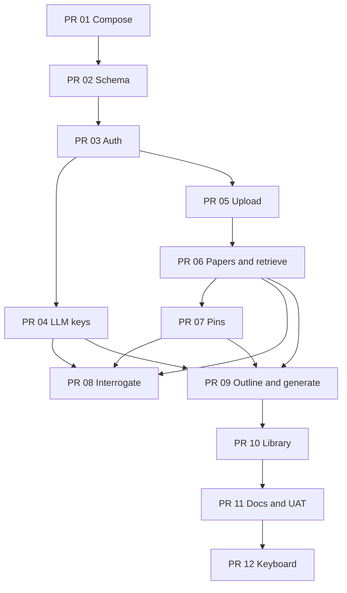

# Implementation plan

| Field | Value |
|---|---|
| **Title** | arpw-local slice plan |
| **Date** | 2026-09-19 |
| **Status** | Draft |
| **Spec** | [ARCHITECTURE.md](./ARCHITECTURE.md) (behavior, schema, APIs, Key Decisions) |
| **Intent** | [PRODUCT_REQUIREMENTS.md](./PRODUCT_REQUIREMENTS.md) |

This file is the **order of work**. Architecture is the **what**. Do not duplicate Key Decisions here. If a slice blurb disagrees with D1–D16, D1–D16 wins.

Incremental, independently reviewable. Inspired by RAGged `slice01`…`slice10` but covering ARPW product, not threads. Live code in `~/Code/arpw` and `~/Code/ragged` is the port source — not `ragged/documents/*.md`.

## Order

PR 09 does **not** depend on PR 08: generate does not read interrogation notes. PR 05 does not depend on PR 04: MiniLM ingest needs no chat key.

## PR 01 — Compose scaffold

- **Title:** `slice01: Compose scaffold (api/web/db volumes, health)`
- **Files:** `docker-compose.yml`, `docker-compose.dev.yml`, `api/Dockerfile`, `api/app/main.py` (`/api/health`, `/api/ready`), `api/app/config.py`, `web/Dockerfile`, `web/nginx.conf`, `web` placeholder `index.html`, `.env.example`, `.gitignore`, `pytest.ini`, `tests/unit/test_unit_slice01_scaffold.py`, `tests/uat/test_uat_slice01_scaffold.py`
- **Depends on:** none
- **Description:** `docker compose up --build` serves `:8082` (RAGged keeps `:8080`). Health JSON (`/api/health` async). Named volumes. nginx `client_max_body_size 55m`; default `proxy_read_timeout 600s`. Config constants `MAX_FILE_SIZE` / `MAX_UPLOAD_BODY_BYTES=12582912`. UAT: a **56 MB** POST 413s; do **not** copy RAGged “55m is the multi-file product limit” tests. Own Mailpit sidecar UI `:8026` (SMTP `mail:1025`, not published). No product routes yet. **No chat API keys in `.env.example`.**

## PR 02 — Schema

- **Title:** `slice02: Alembic paper-centric schema`
- **Files:** `api/alembic/*`, `api/app/models.py`, `api/app/db.py`, unit/uat slice02 (pgvector Testcontainers, tables exist, cap triggers, vector 384, FTS column)
- **Depends on:** PR 01
- **Description:** Full D7 schema including `user_papers.attribution JSONB NOT NULL DEFAULT '[]'`, `user_llm_settings` (three Fernet columns + last4 + `chat_provider` default `xai`), `email_tokens.token_hash` UNIQUE, `interrogation_turns.sources TEXT[] DEFAULT '{literature}'`, `match_reference_chunks` with `filter_user` and `filter_model` default `sentence-transformers/all-MiniLM-L6-v2` (never `hash-384`). No `threads`. API boot runs `alembic upgrade head`.

## PR 03 — Auth + Mailpit

- **Title:** `slice03: Cookie JWT, confirmation, password reset`
- **Files:** `auth_utils.py`, `routers/auth.py`, `mailer.py`, `origin.py`, `deps.py`, `web` Login/VerifyEmail/Forgot + **rewritten** ResetPassword (`?token=` → POST `/api/auth/reset-password`) + AuthContext (`GET /me` only) + router shell, Jest validateAuth, unit/uat auth tests
- **Depends on:** PR 02
- **Description:** Register does not set cookie; **409 if email taken** (not a resend). Confirm via this stack’s Mailpit `:8026`. Invalid confirm → 302 `/verify-email?error=invalid`. Login 403 unconfirmed. Reset one-shot from query token (not GoTrue `isRecovery`). CSRF allowlist (missing Origin allowed; no forgot/reset exempt). Password min 6. Unique `token_hash`; 3600s; resend-only invalidates prior unused confirm tokens in the same transaction. AuthContext does **not** fetch `/settings/llm` yet (PR 04).

## PR 04 — Profile + LLM keys

- **Title:** `slice04: Profile name and encrypted OpenAI / xAI / Anthropic keys`
- **Files:** `crypto.py`, `services/llm_keys.py`, `routers/settings.py`, Profile + RAGged LlmSettings, AuthContext llm fetch, optional header provider switch, llm unit/uat
- **Depends on:** PR 03
- **Description:** GET/PUT `/settings/llm`; last4 per provider; `chat_provider` dropdown; xAI `xai-` shape; empty string clears; no HTTP decrypt route; **no env-file key fallback**. AuthContext calls `GET /api/settings/llm` after `/me`. Default `chat_provider=xai`. Port `ragged/tests/unit/test_unit_llm_settings.py`.

## PR 05 — Upload / ingest core

- **Title:** `slice05: Per-file reference/example upload with MiniLM ingest`
- **Files:** `services/{files,extract,chunk,classify,embeddings}.py`, `routers/documents.py`, UploadZone/DocumentList (one POST per file, in-flight concurrency 2), `tests/fixtures/nfr7.pdf`, ingest unit/uat
- **Depends on:** PR 03 (confirmed user)
- **Description:** One-file POST; RAGged `_ingest_one` internally; ARPW types/caps/`count(*)` all statuses/roles/IMRaD/`chunk_role`. Stored `embedding_model` always `sentence-transformers/all-MiniLM-L6-v2` (stub writes the same string). Stale timeout. Delete unlinks volume. NFR-4 < 120s on fixture. Always 201 with `status`/`error_message` (no all-failed 422). **No** bibliographic lookup yet (PR 10). Body/timeout numbers from Configuration, not PR 12.

## PR 06 — Papers CRUD + Query sources retrieve

- **Title:** `slice06: Papers and hybrid retrieval`
- **Files:** `routers/papers.py` (CRUD), `services/retrieve.py`, `services/templates.py`, Prompt tab Query sources, retrieval tests (`nfr7probe`, role filter, FTS/RRF)
- **Depends on:** PR 05
- **Description:** Dashboard create/continue. Start-paper **type dropdown** (four options). Prompt tab: eight section checkboxes + Paper Type / Citation Style / Output Format dropdowns. Retrieve pins-ready (pins empty). Frozen templates. MiniLM-only SQL (`embedding_model = :filter_model`); empty pool does **not** search a second model. Unit: no `matchWithModelFallback`; 422 on unknown `paper_type`. No `chat.complete` yet. `user_papers` includes `attribution` default `[]`.

## PR 07 — Pins

- **Title:** `slice07: Pinned passages`
- **Files:** pin routes on papers, `lib/pins` port, Prompt list/unpin, pin from Query sources, pins unit/uat
- **Depends on:** PR 06
- **Description:** Composite FKs; examples rejected; `Interrogate` target rejected; isolation tests.

## PR 08 — Interrogate

- **Title:** `slice08: Interrogate corpus as paper notes`
- **Files:** `services/{interrogate,chat}.py`, `routers/interrogate.py`, InterrogatePanel, notes persist, interrogate unit/uat (missing key, 401, bibliography drop)
- **Depends on:** PR 04, PR 06, PR 07
- **Description:** Grounded Q&A via `chat.complete` (same helper generate will use). Default `sources=["literature"]`; checkboxes for primary and examples. **Selected-provider key check before retrieve**; empty passages skip the LLM but missing key is still 400. Literature quota 16/20 when literature is included. `filter_role` maps then strips. 120s timeout → `CHAT_TIMEOUT_MESSAGE`. Turns are not evidence; pin literature/primary, not examples. Unit: default omits a matching `primary` file; all-three include still has ≥16 literature hits when they exist.

## PR 09 — Outline + generate + QUAL

- **Title:** `slice09: Outline and section-by-section generate`
- **Files:** `services/{generate,outline,attribution,citation_check,format_check,citations,chat}.py`, `routers/generate.py`, Prompt Generate / Generate outline, DraftPreview, `web/nginx.conf` **full generate location** (duplicate `proxy_pass` + headers + `2100s`, trailing slash optional), generate unit (strip unknown ids; `sourceIds`/`systemPrompt` stripped not 422; hanging httpx → `CHAT_TIMEOUT_MESSAGE`; optional `citation_style`/`output_format`; openai/xai/anthropic dispatch) + uat missing-key + nginx.conf assertion
- **Depends on:** PR 04, PR 06, PR 07 (**not** PR 08 — generate does not need interrogation notes)
- **Description:** Same `chat.complete` and `chat_provider` as Interrogate (D6). Pins first; frozen templates; save draft + `attribution` without clobbering `paper_type`; one repair pass; QUAL-1–4 payload. nginx generate block ships **here** (7 chat sections × complete+repair = 1680s + slack → 2100s; full proxy settings, not timeout-only). Outline stays on `/api/` 600s. Keep `/api/health` async.

## PR 10 — Library, export, citations

- **Title:** `slice10: Library, regenerate, Markdown/Word export, citation_text`
- **Files:** LibraryPage, export helpers (Jest), `services/bibliographic.py`, `citations` router, regenerate, pagination 25; optional ingest hook to fill `citation_text` on upload
- **Depends on:** PR 09
- **Description:** Continue restores title/type/sections/prompt/outline/`attribution`. Delete confirm. Export includes disclaimer. Source citations editable; DOI lookup. Bibliographic split out of PR 05.

## PR 11 — Docs + smoke + literature-review UAT

- **Title:** `slice11: README Diataxis, smoke.sh, UAT playbook`
- **Files:** `README.md`, `docs/*`, `scripts/smoke.sh`, `UAT/README.md` + `UAT/run-literature-review.mjs` pointed at nginx `:8080`, `tests/dogfood/*`
- **Depends on:** PR 10
- **Description:** User-facing walkthrough. UAT is the generate dogfood gate (pasted key for the selected `chat_provider`). **Do not copy 180s upload waits or 300s generate wait.** Use `UAT_UPLOAD_WAIT_MS(n)` / `UAT_GENERATE_WAIT_MS=1260000` / outline 180s (Testing in ARCHITECTURE). No PII PDFs committed. Run against `:8080`, not webpack `:3000`.

## PR 12 — Polish / NFR-6 keyboard

- **Title:** `slice12: Keyboard flows and empty states`
- **Files:** control ids (NFR-6), skip-to-main, empty states (no files / no key / failed parse)
- **Depends on:** PR 11
- **Description:** Login, upload, generate reachable from keyboard (ARPW `keyboardFlows.ts`). **No nginx timeout work** — that shipped in PR 01 (55m / 600s) and PR 09 (generate 2100s).
